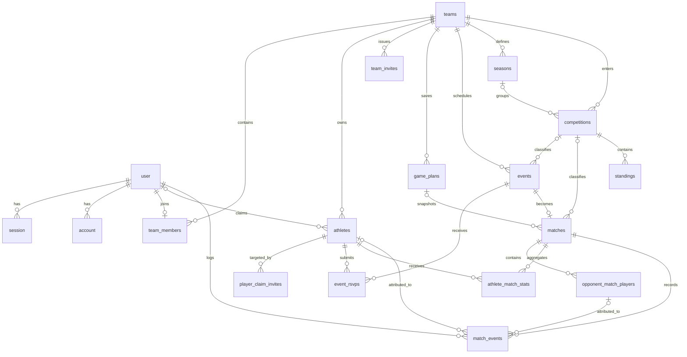
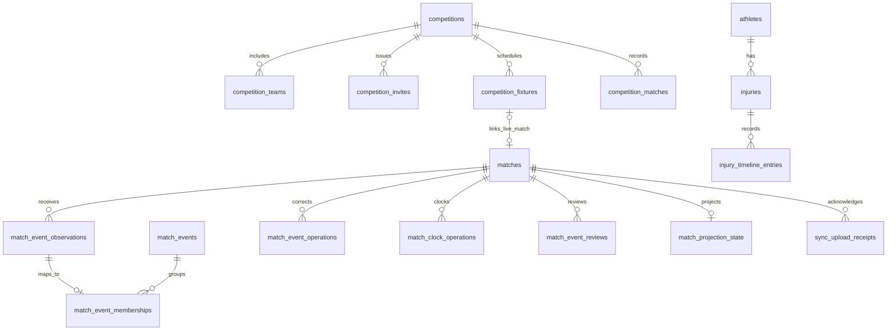

# Current PostgreSQL Database Schema

**Historical source for the detailed sections below:** `backend/src/database/schema/index.ts` at application commit `e7285f53`, checked 14 September 2026. That version defined **19 tables and 14 PostgreSQL enums**. SQL migrations `0000`–`0019` were inspected but were not executed during that update. The [current declaration inventory](#current-schema-declaration-inventory) is at the end of this page.

## Entity relationships

`verification` is a stand-alone Better Auth token table. Invitation creator/consumer fields also reference `user`, although those edges are omitted above for readability.

## Type notation

- `PK` primary key; `FK` foreign key; `UQ` unique constraint/index; `NN` not null.
- All application UUID primary keys use `defaultRandom()`. Better Auth identity keys are text.
- Unless stated otherwise, `created_at` and `updated_at` are `timestamptz NN DEFAULT now()`.
- A column without `NN` is nullable and defaults to `NULL` unless another default is shown.

## Authentication and identity tables

### `user`

`id text PK`; `name text NN`; `email text NN UQ`; `email_verified boolean NN DEFAULT false`; `image text`; `phone_number text`; `sex sex`; `date_of_birth date`; timestamps.

### `session`

`id text PK`; `expires_at timestamptz NN`; `token text NN UQ`; timestamps; `ip_address text`; `user_agent text`; `user_id text NN FK → user.id ON DELETE CASCADE`.

Index: `session_user_id_index(user_id)`.

### `account`

`id text PK`; `account_id text NN`; `provider_id text NN`; `user_id text NN FK → user.id ON DELETE CASCADE`; `access_token text`; `refresh_token text`; `id_token text`; `access_token_expires_at timestamptz`; `refresh_token_expires_at timestamptz`; `scope text`; `password text`; timestamps.

Index: `account_user_id_index(user_id)`.

### `verification`

`id text PK`; `identifier text NN`; `value text NN`; `expires_at timestamptz NN`; timestamps.

Index: `verification_identifier_index(identifier)`.

## Team, roster and invitation tables

### `teams`

`id uuid PK DEFAULT random`; `name text NN`; `primary_color text`; timestamps.

### `team_members`

`id uuid PK DEFAULT random`; `team_id uuid NN FK → teams.id ON DELETE CASCADE`; `user_id text NN FK → user.id ON DELETE CASCADE`; `role team_role NN DEFAULT assistant`; timestamps.

Indexes/uniques: indexes on `team_id` and `user_id`; `team_members_user_unique(user_id)` currently limits a user to one membership; `team_members_team_user_unique(team_id,user_id)` prevents duplicate membership.

### `athletes`

`id uuid PK DEFAULT random`; `team_id uuid NN FK → teams.id ON DELETE CASCADE`; `first_name text NN`; `last_name text NN`; `date_of_birth date`; `position text`; `squad_number integer`; `status athlete_status NN DEFAULT available`; `archived_at timestamptz`; `user_id text FK → user.id ON DELETE SET NULL`; timestamps.

Indexes/uniques: `team_id`; `(team_id,last_name,first_name)`; `user_id`; partial UQ `(team_id,user_id) WHERE user_id IS NOT NULL`. One person may therefore claim athlete records on different teams, but not two records on one team.

### `player_claim_invites`

`id uuid PK DEFAULT random`; `athlete_id uuid NN FK → athletes.id ON DELETE CASCADE`; `token_hash text NN UQ`; `status claim_invite_status NN DEFAULT pending`; `created_by_user_id text NN FK → user.id`; `expires_at timestamptz NN`; `used_at timestamptz`; `used_by_user_id text FK → user.id`; timestamps.

Indexes: `athlete_id`, `token_hash`. Only a SHA-256 token hash is stored; the raw one-time token is not persisted.

### `team_invites`

`id uuid PK DEFAULT random`; `team_id uuid NN FK → teams.id ON DELETE CASCADE`; `email text NN`; `token_hash text NN UQ`; `status team_invite_status NN DEFAULT pending`; `created_by_user_id text NN FK → user.id`; `expires_at timestamptz NN`; `used_at timestamptz`; `used_by_user_id text FK → user.id`; timestamps.

Indexes: `team_id`, `token_hash`. Service logic binds acceptance to the signed-in user's matching email.

## Planning and event tables

### `game_plans`

`id uuid PK DEFAULT random`; `team_id uuid NN FK → teams.id ON DELETE CASCADE`; `name text NN`; `formation_id text NN DEFAULT '4-3-3'`; `assignments jsonb NN DEFAULT {}`; `substitute_ids jsonb NN DEFAULT []`; `defensive_style defensive_style NN DEFAULT balanced`; `defensive_width integer NN DEFAULT 5`; `defensive_depth integer NN DEFAULT 5`; `offensive_style offensive_style NN DEFAULT balanced`; `offensive_width integer NN DEFAULT 5`; `players_in_box integer NN DEFAULT 4`; `corners_commitment integer NN DEFAULT 3`; `free_kicks_commitment integer NN DEFAULT 3`; `captain_id`, `free_kick_taker_id`, `penalty_taker_id`, `corner_taker_id` are nullable UUID FKs → `athletes.id ON DELETE SET NULL`; timestamps.

Indexes/uniques: `team_id`; UQ `(team_id,name)`. Athlete IDs inside the two JSON fields are application-validated references, not database foreign keys.

### `events`

`id uuid PK DEFAULT random`; `team_id uuid NN FK → teams.id ON DELETE CASCADE`; `title text NN`; `type event_type NN`; `status event_status NN DEFAULT scheduled`; `scheduled_at timestamptz NN`; `location text NN`; `venue_address text`; `weather_location text`; `latitude double precision`; `longitude double precision`; `timezone text`; `notes text`; `competition_id uuid FK → competitions.id ON DELETE SET NULL`; timestamps.

Indexes: `team_id`; `(team_id,scheduled_at)`; `competition_id`. The Drizzle properties call the last three weather fields latitude/longitude/timezone for compatibility with migration `0018`.

### `event_rsvps`

`id uuid PK DEFAULT random`; `event_id uuid NN FK → events.id ON DELETE CASCADE`; `athlete_id uuid NN FK → athletes.id ON DELETE CASCADE`; `status rsvp_status NN`; `note text`; `responded_at timestamptz NN DEFAULT now()`; timestamps.

Indexes/uniques: `event_id`; UQ `(event_id,athlete_id)`.

### `seasons`

`id uuid PK DEFAULT random`; `team_id uuid NN FK → teams.id ON DELETE CASCADE`; `name text NN`; `start_date date NN`; `end_date date NN`; `is_current boolean NN DEFAULT false`; timestamps.

Indexes/uniques: `team_id`; `(team_id,start_date)`; UQ `(team_id,name)`; partial UQ `(team_id) WHERE is_current`. Date-range non-overlap is enforced by application logic, not a database exclusion constraint.

### `competitions`

`id uuid PK DEFAULT random`; `team_id uuid NN FK → teams.id ON DELETE CASCADE`; `name text NN`; `type competition_type NN`; `season_id uuid FK → seasons.id ON DELETE SET NULL`; `season text` (deprecated free-text compatibility field); timestamps.

Indexes: `team_id`, `season_id`.

## Match and statistics tables

### `matches`

`id uuid PK DEFAULT random`; `event_id uuid NN UQ FK → events.id ON DELETE CASCADE`; `competition_id uuid FK → competitions.id ON DELETE SET NULL`; `opponent_name text NN`; `is_home boolean NN DEFAULT true`; `team_score integer NN DEFAULT 0`; `opponent_score integer NN DEFAULT 0`; `game_plan_id uuid FK → game_plans.id ON DELETE SET NULL`; `game_plan_snapshot jsonb`; `opponent_squad_visibility opponent_squad_visibility NN DEFAULT none`; `team_color text`; `opponent_color text`; `clock_period text NN DEFAULT not_started`; `clock_elapsed_ms integer NN DEFAULT 0`; `clock_started_at timestamptz`; timestamps.

Indexes: `competition_id`, `game_plan_id`. `game_plan_snapshot` deliberately preserves match-time tactics if a saved plan later changes or is deleted.

### `opponent_match_players`

`id uuid PK DEFAULT random`; `match_id uuid NN FK → matches.id ON DELETE CASCADE`; `shirt_number integer NN`; `name text`; `position text`; timestamps.

Indexes/uniques: `match_id`; UQ `(match_id,shirt_number)`. Application validation controls when names are forbidden/required for numbers/full modes.

### `athlete_match_stats`

`id uuid PK DEFAULT random`; `match_id uuid NN FK → matches.id ON DELETE CASCADE`; `athlete_id uuid NN FK → athletes.id ON DELETE CASCADE`; `started boolean NN DEFAULT true`; `minutes_played integer`; `goals`, `assists`, `yellow_cards`, `red_cards` are integers `NN DEFAULT 0`; timestamps.

Indexes/uniques: `athlete_id`; UQ `(match_id,athlete_id)`.

### `standings`

`id uuid PK DEFAULT random`; `competition_id uuid NN FK → competitions.id ON DELETE CASCADE`; `team_name text NN`; `position integer NN`; `played`, `won`, `drawn`, `lost`, `goals_for`, `goals_against`, `points` are integers `NN DEFAULT 0`; `is_own_team boolean NN DEFAULT false`; timestamps.

Indexes/uniques: `competition_id`; UQ `(competition_id,position)`; UQ `(competition_id,team_name)`. Coaches enter standings; the application cannot derive other clubs' results.

### `match_events`

`id uuid PK DEFAULT random`; `match_id uuid NN FK → matches.id ON DELETE CASCADE`; `athlete_id uuid FK → athletes.id ON DELETE SET NULL`; `team match_event_team NN`; `opponent_label text`; `opponent_player_id uuid FK → opponent_match_players.id ON DELETE SET NULL`; `event_type match_event_type NN`; `minute integer NN`; `detail text`; `logged_by_user_id text NN FK → user.id`; `manually_adjusted boolean NN DEFAULT false`; `client_request_id uuid`; timestamps.

Indexes/uniques: `match_id`; `opponent_player_id`; `(match_id,athlete_id,event_type)`; partial UQ `(match_id,client_request_id) WHERE client_request_id IS NOT NULL`.

## Enums

| Enum | Values |
| --- | --- |
| `sex` | `male`, `female`, `prefer_not_to_say` |
| `team_role` | `coach`, `assistant` |
| `event_type` | `match`, `training`, `meeting` |
| `event_status` | `scheduled`, `cancelled`, `completed` |
| `athlete_status` | `available`, `injured`, `suspended` |
| `claim_invite_status` | `pending`, `used`, `revoked` |
| `team_invite_status` | `pending`, `used`, `revoked` |
| `defensive_style` | `drop_back`, `balanced`, `pressure_on_heavy_touch`, `press_after_possession_loss`, `constant_pressure` |
| `offensive_style` | `possession`, `balanced`, `fast_build_up`, `long_ball` |
| `rsvp_status` | `going`, `not_going`, `maybe` |
| `competition_type` | `league`, `cup`, `friendly` |
| `opponent_squad_visibility` | `none`, `numbers`, `full` |
| `match_event_team` | `own`, `opponent` |
| `match_event_type` | `goal`, `assist`, `key_pass`, `yellow_card`, `red_card`, `substitution`, `penalty`, `injury` |

## Database constraints versus application restrictions

Foreign keys ensure referenced rows exist and define delete behaviour. They do **not** prove that two referenced rows belong to the same team, that a caller is a coach, that a match event athlete was selected, that a season range does not overlap, or that an opponent name is permitted for the selected visibility mode. Those rules are enforced in Zod schemas and services using the authenticated user's resolved team. Both layers are required.

Athlete archiving is a soft-delete behaviour using `archived_at`. Team deletion cascades broadly through team-owned data. Deleting referenced athletes/users can be restricted where no `ON DELETE` action is declared, or can set attribution fields to null as specified above.

## PostgreSQL, Neon and Drizzle

PostgreSQL provides relational constraints, indexes, enums, JSONB and transactions expected by the model. Neon supplies hosted PostgreSQL and the HTTP serverless driver. Drizzle keeps a typed schema beside the application and generates/replays reviewed SQL migrations. Better Auth uses Drizzle's schema adapter; interactive transactions are disabled in its configuration because the `neon-http` driver does not support them.

Required configuration and safe migration commands are in [Getting Started](../../Overview/01-getting-started.md). `GET /health/database` runs a `SELECT 1`; success returns database status `ok`, while an unavailable database produces an error response. It checks reachability, not migration completeness or data correctness.

## Migration verification concerns

The migration journal is not cleanly monotonic:

- journal index `11` appears twice for `0011_puzzling_jackal` and `0011_add_team_invites`;
- timestamp `1789119552109` for `0015_absurd_carnage` precedes the recorded `0014` timestamp `1789200000000`;
- `token_hash` on each invitation table is unique and also has a separate ordinary index, which is likely redundant in PostgreSQL;
- migration files still contain historical `lineups` migrations although the current schema uses `game_plans`.

These are unresolved verification concerns, not proof of failure. No fresh-install or upgrade migration was run, so this documentation does not claim either path succeeds. Before release, test the complete migration chain and an upgrade from the deployed schema against disposable databases, record outputs, and reconcile the journal only through a reviewed application change.

## Current schema declaration inventory

### Newer subsystem relationships

This diagram is a readable subsystem view of declared references, not a complete physical ERD. Not every conditional or application-enforced relationship is a foreign key. For example, an injury's `match_event_id` is optional and uses `ON DELETE SET NULL` so removing a mis-tapped event does not erase its clinical record. Observation IDs are client-generated and immutable; membership rows connect them to canonical match events. Upload receipt IDs and payload hashes support idempotent retry, while revision fields on fixture schedules and match projections guard concurrent updates. See the [schema source](https://github.com/nayan-m15/Gaffer/blob/ef2880ad0018536c2b933754148e285b2a325ec7/backend/src/database/schema/index.ts) for exact field types, constraints and index expressions, and [offline collaboration](../offline-collaboration.md) for the write path.

The table below lists column names from the current Drizzle declarations. Types, nullability, indexes, defaults and foreign-key actions are defined by [`index.ts`](https://github.com/nayan-m15/Gaffer/blob/ef2880ad0018536c2b933754148e285b2a325ec7/backend/src/database/schema/index.ts) and migration SQL. The detailed descriptions above remain a 14 September snapshot and are not a complete current schema contract.

**Declaration count:** 33 tables; 25 enums.

| Table | Declared columns |
| --- | --- |
| `user` | `id`, `name`, `email`, `emailVerified`, `image`, `phoneNumber`, `sex`, `dateOfBirth` |
| `session` | `id`, `expiresAt`, `token`, `createdAt`, `updatedAt`, `ipAddress`, `userAgent`, `userId` |
| `account` | `id`, `accountId`, `providerId`, `userId`, `accessToken`, `refreshToken`, `idToken`, `accessTokenExpiresAt`, `refreshTokenExpiresAt`, `scope`, `password` |
| `verification` | `id`, `identifier`, `value`, `expiresAt` |
| `teams` | `id`, `name`, `primaryColor` |
| `team_members` | `id`, `teamId`, `userId`, `role` |
| `athletes` | `id`, `teamId`, `firstName`, `lastName`, `dateOfBirth`, `position`, `squadNumber`, `status`, `archivedAt`, `userId` |
| `player_claim_invites` | `id`, `athleteId`, `email`, `tokenHash`, `status`, `createdByUserId`, `expiresAt`, `usedAt`, `usedByUserId` |
| `team_invites` | `id`, `teamId`, `email`, `tokenHash`, `status`, `createdByUserId`, `expiresAt`, `usedAt`, `usedByUserId` |
| `game_plans` | `id`, `teamId`, `name`, `formationId`, `assignments`, `substituteIds`, `defensiveStyle`, `defensiveWidth`, `defensiveDepth`, `offensiveStyle`, `offensiveWidth`, `playersInBox`, `cornersCommitment`, `freeKicksCommitment`, `captainId`, `freeKickTakerId`, `penaltyTakerId`, `cornerTakerId` |
| `events` | `id`, `teamId`, `title`, `type`, `status`, `scheduledAt`, `location`, `venueAddress`, `weatherLocation`, `weatherLatitude`, `weatherLongitude`, `weatherTimezone`, `notes`, `competitionId`, `competitionFixtureId` |
| `event_rsvps` | `id`, `eventId`, `athleteId`, `status`, `note`, `respondedAt` |
| `seasons` | `id`, `teamId`, `name`, `startDate`, `endDate`, `isCurrent` |
| `competitions` | `id`, `teamId`, `name`, `type`, `seasonId`, `season`, `adminUserId`, `format`, `configuredTeamCount`, `maxSubstitutes`, `redCardSuspensionMatches`, `accumulatedYellowThreshold`, `yellowSuspensionMatches`, `startDate`, `allowedPlayingDays`, `defaultKickoffTime`, `fixturesPerOpponent`, `pointsWin`, `pointsDraw`, `pointsLoss`, `qualifierCount`, `resultTrackingStartedAt` |
| `competition_teams` | `id`, `competitionId`, `teamId`, `displayName` |
| `competition_invites` | `id`, `competitionId`, `competitionTeamId`, `email`, `tokenHash`, `status`, `createdByUserId`, `expiresAt`, `usedAt`, `usedByUserId` |
| `matches` | `id`, `eventId`, `competitionId`, `opponentCompetitionTeamId`, `opponentName`, `isHome`, `teamScore`, `opponentScore`, `gamePlanId`, `gamePlanSnapshot`, `opponentSquadVisibility`, `teamColor`, `opponentColor`, `clockPeriod`, `clockElapsedMs`, `clockStartedAt`, `clockRevision` |
| `competition_matches` | `id`, `competitionId`, `homeCompetitionTeamId`, `awayCompetitionTeamId`, `homeScore`, `awayScore`, `playedAt`, `createdByUserId` |
| `opponent_match_players` | `id`, `matchId`, `shirtNumber`, `name`, `position` |
| `athlete_match_stats` | `id`, `matchId`, `athleteId`, `started`, `minutesPlayed`, `goals`, `assists`, `yellowCards`, `redCards` |
| `standings` | `id`, `competitionId`, `teamName`, `position`, `played`, `won`, `drawn`, `lost`, `goalsFor`, `goalsAgainst`, `points`, `isOwnTeam` |
| `match_events` | `id`, `matchId`, `athleteId`, `team`, `opponentLabel`, `opponentPlayerId`, `eventType`, `minute`, `detail`, `loggedByUserId`, `manuallyAdjusted`, `clientRequestId`, `period`, `matchElapsedMs`, `structuredPayload`, `lifecycleStatus`, `rulesVersion`, `projectionRevision` |
| `injuries` | `id`, `teamId`, `athleteId`, `bodyRegion`, `injuryType`, `severity`, `status`, `context`, `occurredOn`, `matchId`, `matchEventId`, `minute`, `estimatedReturnMinDays`, `estimatedReturnMaxDays`, `estimatedReturnFrom`, `estimatedReturnTo`, `actualReturnOn`, `diagnosedBy`, `description`, `notes`, `rehabPhases`, `closedAt`, `createdByUserId` |
| `injury_timeline_entries` | `id`, `injuryId`, `kind`, `occurredOn`, `title`, `detail`, `createdByUserId` |
| `match_event_observations` | `id`, `matchId`, `deviceId`, `loggedByUserId`, `schemaVersion`, `eventType`, `team`, `athleteId`, `opponentLabel`, `opponentPlayerId`, `period`, `matchElapsedMs`, `payload`, `payloadHash`, `clientCreatedAt`, `serverReceivedAt` |
| `match_event_memberships` | `observationId`, `canonicalEventId`, `projectionRevision`, `createdAt` |
| `match_event_operations` | `id`, `matchId`, `actorUserId`, `operationType`, `targetObservationIds`, `canonicalEventId`, `causalParentIds`, `decision`, `reason`, `schemaVersion`, `createdAt` |
| `match_clock_operations` | `id`, `matchId`, `actorUserId`, `period`, `elapsedMs`, `running`, `baseRevision`, `appliedRevision`, `outcome`, `payloadHash`, `clientCreatedAt`, `createdAt` |
| `match_event_reviews` | `id`, `matchId`, `canonicalEventId`, `reason`, `status`, `resolution`, `resolvedByUserId`, `resolvedAt` |
| `competition_fixtures` | `id`, `competitionId`, `stage`, `round`, `position`, `homeCompetitionTeamId`, `awayCompetitionTeamId`, `scheduledAt`, `status`, `homeScore`, `awayScore`, `homePenaltyScore`, `awayPenaltyScore`, `winnerCompetitionTeamId`, `nextFixtureId`, `nextFixtureSlot`, `linkedMatchId`, `legacyResultId`, `scheduleRevision`, `homeScheduleResponse`, `awayScheduleResponse`, `homeScheduleRespondedAt`, `awayScheduleRespondedAt`, `homeScheduleRespondedByUserId`, `awayScheduleRespondedByUserId`, `scheduleProposedByCompetitionTeamId`, `scheduleProposalNote`, `scheduleConfirmedAt` |
| `match_projection_state` | `matchId`, `revision`, `inputDigest`, `rulesVersion`, `confirmedTeamScore`, `confirmedOpponentScore`, `provisionalTeamScore`, `provisionalOpponentScore`, `possibleEffects`, `disciplinaryProjection`, `unresolvedReviewCount`, `finalisationState`, `finalisedByUserId`, `finalisedAt` |
| `sync_upload_receipts` | `id`, `submittedByUserId`, `matchId`, `itemType`, `payloadHash`, `outcome`, `safeErrorCode`, `processingDurationMs`, `canonicalEventId` |
| `sync_client_telemetry` | `deviceId`, `userId`, `teamId`, `pendingCount`, `rejectedCount`, `oldestPendingAt`, `lastSuccessfulSyncAt`, `deployment`, `updatedAt` |

**Current enums:** `sex`, `team_role`, `event_type`, `event_status`, `athlete_status`, `claim_invite_status`, `team_invite_status`, `defensive_style`, `offensive_style`, `rsvp_status`, `competition_type`, `opponent_squad_visibility`, `competition_format`, `competition_fixture_stage`, `competition_fixture_status`, `competition_fixture_schedule_response`, `competition_invite_status`, `match_event_team`, `match_event_type`, `injury_body_region`, `injury_type`, `injury_severity`, `injury_status`, `injury_context`, `injury_timeline_kind`.

### Migration and deployment procedure

The schema declaration is application source, while applied SQL migrations are the database contract. When a developer intentionally changes `backend/src/database/schema/index.ts`, run `npm.cmd --prefix backend run db:generate`, review the generated SQL and journal entry, then apply it with `npm.cmd --prefix backend run db:migrate` against an isolated development database. Test both a fresh install and an upgrade from a copy of the deployed schema before promoting the migration. Record migration file names, database branch, command output and application commit. This audit did not execute that chain, inspect the production migration table or establish which migrations Render/Neon has applied. Do not repair the journal discrepancy below through a documentation-only edit.

### Important current uniqueness and lookup rules

The table callback definitions add constraints beyond the column flags below. `competition_teams` allows one linked team per competition and case-insensitively unique display names; unlinked slots are exempt from the linked-team partial index. `competition_fixtures` uniquely identifies a round position, participant pair, downstream fixture slot, linked match and legacy result. Composite foreign keys connect fixture participants to slots in the **same competition**. A competition name has a case-insensitive unique index. `competition_invites` limits a pending invitation per participant slot. `match_event_reviews` allows only one open review per canonical event. `injuries` permits only one clinical record per non-null match event. Match event `(match_id, client_request_id)` is unique when the request ID is present. These are source declarations; migration application on the deployed database was not verified.

Lookup indexes include team/status and athlete/region for injury lists and recurrence, match/period/elapsed-time for observations, match/revision for clock operations, and team/update time for sync telemetry. The exact index names and predicates are in `backend/src/database/schema/index.ts` at the linked commit.

### Current column contract (source-derived)

This compact inventory reads the current Drizzle column declarations. `NN` means not null; `PK` means primary key. Nullable is the default when `NN` is absent. Indexes and composite unique constraints are defined in the table callbacks and migrations; review the linked source before changing the database.

- **`user`**: `id` text (PK); `name` text (NN); `email` text (NN); `email_verified` boolean (NN, default:false); `image` text; `phone_number` text; `sex` enum:sex; `date_of_birth` date; plus shared `created_at`/`updated_at`.
- **`session`**: `id` text (PK); `expires_at` timestamp (NN); `token` text (NN); `created_at` timestamp (NN, default:now); `updated_at` timestamp (NN, default:now); `ip_address` text; `user_agent` text; `user_id` text (NN, FK→user.id, delete:cascade).
- **`account`**: `id` text (PK); `account_id` text (NN); `provider_id` text (NN); `user_id` text (NN, FK→user.id, delete:cascade); `access_token` text; `refresh_token` text; `id_token` text; `access_token_expires_at` timestamp; `refresh_token_expires_at` timestamp; `scope` text; `password` text; plus shared `created_at`/`updated_at`.
- **`verification`**: `id` text (PK); `identifier` text (NN); `value` text (NN); `expires_at` timestamp (NN); plus shared `created_at`/`updated_at`.
- **`teams`**: `id` uuid (PK, default:random UUID); `name` text (NN); `primary_color` text; plus shared `created_at`/`updated_at`.
- **`team_members`**: `id` uuid (PK, default:random UUID); `team_id` uuid (NN, FK→teams.id, delete:cascade); `user_id` text (NN, FK→user.id, delete:cascade); `role` enum:team_role (NN, default:'assistant'); plus shared `created_at`/`updated_at`.
- **`athletes`**: `id` uuid (PK, default:random UUID); `team_id` uuid (NN, FK→teams.id, delete:cascade); `first_name` text (NN); `last_name` text (NN); `date_of_birth` date; `position` text; `squad_number` integer; `status` enum:athlete_status (NN, default:'available'); `archived_at` timestamp; `user_id` text (FK→user.id, delete:set null); plus shared `created_at`/`updated_at`.
- **`player_claim_invites`**: `id` uuid (PK, default:random UUID); `athlete_id` uuid (NN, FK→athletes.id, delete:cascade); `email` text (NN); `token_hash` text (NN); `status` enum:claim_invite_status (NN, default:'pending'); `created_by_user_id` text (NN, FK→user.id); `expires_at` timestamp (NN); `used_at` timestamp; `used_by_user_id` text (FK→user.id); plus shared `created_at`/`updated_at`.
- **`team_invites`**: `id` uuid (PK, default:random UUID); `team_id` uuid (NN, FK→teams.id, delete:cascade); `email` text (NN); `token_hash` text (NN); `status` enum:team_invite_status (NN, default:'pending'); `created_by_user_id` text (NN, FK→user.id); `expires_at` timestamp (NN); `used_at` timestamp; `used_by_user_id` text (FK→user.id); plus shared `created_at`/`updated_at`.
- **`game_plans`**: `id` uuid (PK, default:random UUID); `team_id` uuid (NN, FK→teams.id, delete:cascade); `name` text (NN); `formation_id` text (NN, default:'4-3-3'); `assignments` jsonb (NN, default:{}); `substitute_ids` jsonb (NN, default:[]); `defensive_style` enum:defensive_style (NN, default:'balanced'); `defensive_width` integer (NN, default:5); `defensive_depth` integer (NN, default:5); `offensive_style` enum:offensive_style (NN, default:'balanced'); `offensive_width` integer (NN, default:5); `players_in_box` integer (NN, default:4); `corners_commitment` integer (NN, default:3); `free_kicks_commitment` integer (NN, default:3); `captain_id` uuid (FK→athletes.id, delete:set null); `free_kick_taker_id` uuid (FK→athletes.id, delete:set null); `penalty_taker_id` uuid (FK→athletes.id, delete:set null); `corner_taker_id` uuid (FK→athletes.id, delete:set null); plus shared `created_at`/`updated_at`.
- **`events`**: `id` uuid (PK, default:random UUID); `team_id` uuid (NN, FK→teams.id, delete:cascade); `title` text (NN); `type` enum:event_type (NN); `status` enum:event_status (NN, default:'scheduled'); `scheduled_at` timestamp (NN); `location` text (NN); `venue_address` text; `weather_location` text; `latitude` doublePrecision; `longitude` doublePrecision; `timezone` text; `notes` text; `competition_id` uuid (FK→competitions.id, delete:set null); `competition_fixture_id` uuid; plus shared `created_at`/`updated_at`.
- **`event_rsvps`**: `id` uuid (PK, default:random UUID); `event_id` uuid (NN, FK→events.id, delete:cascade); `athlete_id` uuid (NN, FK→athletes.id, delete:cascade); `status` enum:rsvp_status (NN); `note` text; `responded_at` timestamp (NN, default:now); plus shared `created_at`/`updated_at`.
- **`seasons`**: `id` uuid (PK, default:random UUID); `team_id` uuid (NN, FK→teams.id, delete:cascade); `name` text (NN); `start_date` date (NN); `end_date` date (NN); `is_current` boolean (NN, default:false); plus shared `created_at`/`updated_at`.
- **`competitions`**: `id` uuid (PK, default:random UUID); `team_id` uuid (NN, FK→teams.id, delete:cascade); `name` text (NN); `type` enum:competition_type (NN); `season_id` uuid (FK→seasons.id, delete:set null); `season` text; `admin_user_id` text (FK→user.id, delete:set null); `format` enum:competition_format; `configured_team_count` integer; `max_substitutes` integer (NN, default:5); `red_card_suspension_matches` integer (NN, default:1); `accumulated_yellow_threshold` integer (NN, default:5); `yellow_suspension_matches` integer (NN, default:1); `start_date` date; `allowed_playing_days` integer (NN, default:sql`ARRAY[6]::integer[]`); `default_kickoff_time` text (NN, default:'15:00'); `fixtures_per_opponent` integer (NN, default:1); `points_win` integer (NN, default:3); `points_draw` integer (NN, default:1); `points_loss` integer (NN, default:0); `qualifier_count` integer; `result_tracking_started_at` timestamp (NN, default:now); plus shared `created_at`/`updated_at`.
- **`competition_teams`**: `id` uuid (PK, default:random UUID); `competition_id` uuid (NN, FK→competitions.id, delete:cascade); `team_id` uuid (FK→teams.id, delete:set null); `display_name` text (NN); plus shared `created_at`/`updated_at`.
- **`competition_invites`**: `id` uuid (PK, default:random UUID); `competition_id` uuid (NN, FK→competitions.id, delete:cascade); `competition_team_id` uuid (NN, FK→competition_teams.id, delete:cascade); `email` text (NN); `token_hash` text (NN); `status` enum:competition_invite_status (NN, default:'pending'); `created_by_user_id` text (NN, FK→user.id); `expires_at` timestamp (NN); `used_at` timestamp; `used_by_user_id` text (FK→user.id); plus shared `created_at`/`updated_at`.
- **`matches`**: `id` uuid (PK, default:random UUID); `event_id` uuid (NN, FK→events.id, delete:cascade); `competition_id` uuid (FK→competitions.id, delete:set null); `opponent_competition_team_id` uuid (FK→competition_teams.id, delete:set null); `opponent_name` text (NN); `is_home` boolean (NN, default:true); `team_score` integer (NN, default:0); `opponent_score` integer (NN, default:0); `game_plan_id` uuid (FK→game_plans.id, delete:set null); `game_plan_snapshot` jsonb; `opponent_squad_visibility` enum:opponent_squad_visibility (NN, default:'none'); `team_color` text; `opponent_color` text; `clock_period` text (NN, default:'not_started'); `clock_elapsed_ms` integer (NN, default:0); `clock_started_at` timestamp; `clock_revision` integer (NN, default:0); plus shared `created_at`/`updated_at`.
- **`competition_matches`**: `id` uuid (PK, default:random UUID); `competition_id` uuid (NN, FK→competitions.id, delete:cascade); `home_competition_team_id` uuid (NN, FK→competition_teams.id, delete:cascade); `away_competition_team_id` uuid (NN, FK→competition_teams.id, delete:cascade); `home_score` integer (NN, default:0); `away_score` integer (NN, default:0); `played_at` timestamp (NN); `created_by_user_id` text (NN, FK→user.id); plus shared `created_at`/`updated_at`.
- **`opponent_match_players`**: `id` uuid (PK, default:random UUID); `match_id` uuid (NN, FK→matches.id, delete:cascade); `shirt_number` integer (NN); `name` text; `position` text; plus shared `created_at`/`updated_at`.
- **`athlete_match_stats`**: `id` uuid (PK, default:random UUID); `match_id` uuid (NN, FK→matches.id, delete:cascade); `athlete_id` uuid (NN, FK→athletes.id, delete:cascade); `started` boolean (NN, default:true); `minutes_played` integer; `goals` integer (NN, default:0); `assists` integer (NN, default:0); `yellow_cards` integer (NN, default:0); `red_cards` integer (NN, default:0); plus shared `created_at`/`updated_at`.
- **`standings`**: `id` uuid (PK, default:random UUID); `competition_id` uuid (NN, FK→competitions.id, delete:cascade); `team_name` text (NN); `position` integer (NN); `played` integer (NN, default:0); `won` integer (NN, default:0); `drawn` integer (NN, default:0); `lost` integer (NN, default:0); `goals_for` integer (NN, default:0); `goals_against` integer (NN, default:0); `points` integer (NN, default:0); `is_own_team` boolean (NN, default:false); plus shared `created_at`/`updated_at`.
- **`match_events`**: `id` uuid (PK, default:random UUID); `match_id` uuid (NN, FK→matches.id, delete:cascade); `athlete_id` uuid (FK→athletes.id, delete:set null); `team` enum:match_event_team (NN); `opponent_label` text; `opponent_player_id` uuid (FK→opponent_match_players.id, delete:set null); `event_type` enum:match_event_type (NN); `minute` integer (NN); `detail` text; `logged_by_user_id` text (NN, FK→user.id); `manually_adjusted` boolean (NN, default:false); `client_request_id` uuid; `period` text (NN, default:'not_started'); `match_elapsed_ms` integer; `structured_payload` jsonb; `lifecycle_status` text (NN, default:'provisional'); `rules_version` integer (NN, default:1); `projection_revision` integer (NN, default:0); plus shared `created_at`/`updated_at`.
- **`injuries`**: `id` uuid (PK, default:random UUID); `team_id` uuid (NN, FK→teams.id, delete:cascade); `athlete_id` uuid (NN, FK→athletes.id, delete:cascade); `body_region` enum:injury_body_region (NN); `injury_type` enum:injury_type (NN); `severity` enum:injury_severity (NN); `status` enum:injury_status (NN, default:'reported'); `context` enum:injury_context (NN, default:'other'); `occurred_on` date (NN); `match_id` uuid (FK→matches.id, delete:set null); `match_event_id` uuid (FK→match_events.id, delete:set null); `minute` integer; `estimated_return_min_days` integer (NN); `estimated_return_max_days` integer (NN); `estimated_return_from` date (NN); `estimated_return_to` date (NN); `actual_return_on` date; `diagnosed_by` text; `description` text; `notes` text; `rehab_phases` jsonb; `closed_at` timestamp; `created_by_user_id` text (NN, FK→user.id); plus shared `created_at`/`updated_at`.
- **`injury_timeline_entries`**: `id` uuid (PK, default:random UUID); `injury_id` uuid (NN, FK→injuries.id, delete:cascade); `kind` enum:injury_timeline_kind (NN); `occurred_on` date (NN); `title` text (NN); `detail` text; `created_by_user_id` text (NN, FK→user.id); plus shared `created_at`/`updated_at`.
- **`match_event_observations`**: `id` uuid (PK); `match_id` uuid (NN, FK→matches.id, delete:cascade); `device_id` uuid (NN); `logged_by_user_id` text (NN, FK→user.id); `schema_version` integer (NN, default:1); `event_type` enum:match_event_type (NN); `team` enum:match_event_team (NN); `athlete_id` uuid (FK→athletes.id, delete:set null); `opponent_label` text; `opponent_player_id` uuid (FK→opponent_match_players.id, delete:set null); `period` text (NN); `match_elapsed_ms` integer (NN); `payload` jsonb (NN); `payload_hash` text (NN); `client_created_at` timestamp (NN); `server_received_at` timestamp (NN, default:now).
- **`match_event_memberships`**: `observation_id` uuid (PK, FK→match_event_observations.id, delete:cascade); `canonical_event_id` uuid (NN, FK→match_events.id, delete:cascade); `projection_revision` integer (NN, default:0); `created_at` timestamp (NN, default:now).
- **`match_event_operations`**: `id` uuid (PK); `match_id` uuid (NN, FK→matches.id, delete:cascade); `actor_user_id` text (NN, FK→user.id); `operation_type` text (NN); `target_observation_ids` jsonb (NN, default:[]); `canonical_event_id` uuid (FK→match_events.id, delete:set null); `causal_parent_ids` jsonb (NN, default:[]); `decision` jsonb (NN); `reason` text; `schema_version` integer (NN, default:1); `created_at` timestamp (NN, default:now).
- **`match_clock_operations`**: `id` uuid (PK); `match_id` uuid (NN, FK→matches.id, delete:cascade); `actor_user_id` text (NN, FK→user.id); `period` text (NN); `elapsed_ms` integer (NN); `running` boolean (NN); `base_revision` integer (NN); `applied_revision` integer (NN); `outcome` text (NN); `payload_hash` text (NN); `client_created_at` timestamp (NN); `created_at` timestamp (NN, default:now).
- **`match_event_reviews`**: `id` uuid (PK, default:random UUID); `match_id` uuid (NN, FK→matches.id, delete:cascade); `canonical_event_id` uuid (NN, FK→match_events.id, delete:cascade); `reason` text (NN); `status` text (NN, default:'open'); `resolution` text; `resolved_by_user_id` text (FK→user.id); `resolved_at` timestamp; plus shared `created_at`/`updated_at`.
- **`competition_fixtures`**: `id` uuid (PK, default:random UUID); `competition_id` uuid (NN, FK→competitions.id, delete:cascade); `stage` enum:competition_fixture_stage (NN); `round` integer (NN); `position` integer (NN); `home_competition_team_id` uuid; `away_competition_team_id` uuid; `scheduled_at` timestamp (NN); `status` enum:competition_fixture_status (NN, default:'scheduled'); `home_score` integer; `away_score` integer; `home_penalty_score` integer; `away_penalty_score` integer; `winner_competition_team_id` uuid; `next_fixture_id` uuid; `next_fixture_slot` text; `linked_match_id` uuid (FK→matches.id); `legacy_result_id` uuid (FK→competition_matches.id); `schedule_revision` integer (NN, default:1); `home_schedule_response` enum:competition_fixture_schedule_response (NN, default:'pending'); `away_schedule_response` enum:competition_fixture_schedule_response (NN, default:'pending'); `home_schedule_responded_at` timestamp; `away_schedule_responded_at` timestamp; `home_schedule_responded_by_user_id` text; `away_schedule_responded_by_user_id` text; `schedule_proposed_by_competition_team_id` uuid; `schedule_proposal_note` text; `schedule_confirmed_at` timestamp; plus shared `created_at`/`updated_at`.
- **`match_projection_state`**: `match_id` uuid (PK, FK→matches.id, delete:cascade); `revision` integer (NN, default:0); `input_digest` text (NN); `rules_version` integer (NN, default:1); `confirmed_team_score` integer (NN, default:0); `confirmed_opponent_score` integer (NN, default:0); `provisional_team_score` integer (NN, default:0); `provisional_opponent_score` integer (NN, default:0); `possible_effects` jsonb (NN, default:{}); `disciplinary_projection` jsonb (NN, default:{}); `unresolved_review_count` integer (NN, default:0); `finalisation_state` text (NN, default:'open'); `finalised_by_user_id` text (FK→user.id); `finalised_at` timestamp; plus shared `created_at`/`updated_at`.
- **`sync_upload_receipts`**: `id` uuid (PK); `submitted_by_user_id` text (NN, FK→user.id); `match_id` uuid (NN, FK→matches.id, delete:cascade); `item_type` text (NN); `payload_hash` text (NN); `outcome` text (NN); `safe_error_code` text; `processing_duration_ms` integer; `canonical_event_id` uuid (FK→match_events.id, delete:set null); plus shared `created_at`/`updated_at`.
- **`sync_client_telemetry`**: `device_id` uuid (PK); `user_id` text (NN, FK→user.id, delete:cascade); `team_id` uuid (FK→teams.id, delete:cascade); `pending_count` integer (NN, default:0); `rejected_count` integer (NN, default:0); `oldest_pending_at` timestamp; `last_successful_sync_at` timestamp; `deployment` text (NN); `updated_at` timestamp (NN, default:now).
