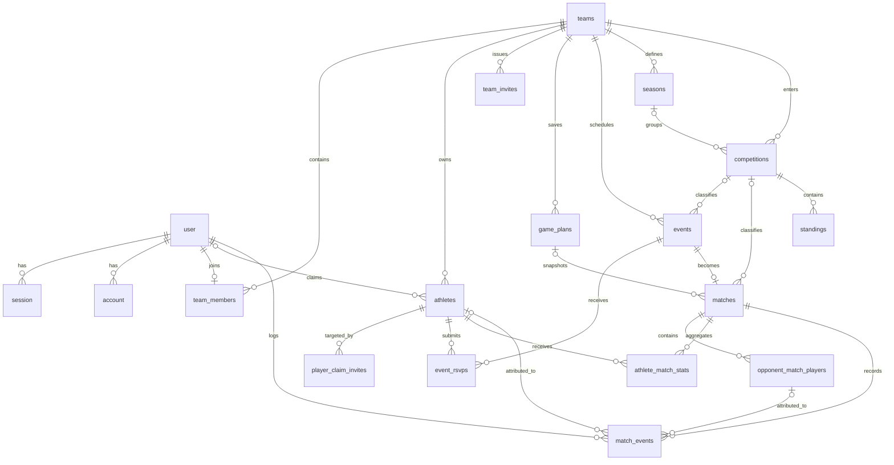

# Current PostgreSQL Database Schema

**Source of truth:** `backend/src/database/schema/index.ts` at application commit `aadf745e`, checked 13 September 2026. The schema defines **19 tables and 14 PostgreSQL enums**. SQL migrations `0000`–`0019` were inspected but were not executed during this documentation update.

## Entity relationships

`verification` is a stand-alone Better Auth token table. Invitation creator/consumer fields also reference `user`, although those edges are omitted above for readability.

## Type notation

- `PK` primary key; `FK` foreign key; `UQ` unique constraint/index; `NN` not null.
- All application UUID primary keys use `defaultRandom()`. Better Auth identity keys are text.
- Unless stated otherwise, `created_at` and `updated_at` are `timestamptz NN DEFAULT now()`.
- A column without `NN` is nullable and defaults to `NULL` unless another default is shown.

## Authentication and identity tables

### `user`

`id text PK`; `name text NN`; `email text NN UQ`; `email_verified boolean NN DEFAULT false`; `image text`; `phone_number text`; `sex sex`; `date_of_birth date`; timestamps.

### `session`

`id text PK`; `expires_at timestamptz NN`; `token text NN UQ`; timestamps; `ip_address text`; `user_agent text`; `user_id text NN FK → user.id ON DELETE CASCADE`.

Index: `session_user_id_index(user_id)`.

### `account`

`id text PK`; `account_id text NN`; `provider_id text NN`; `user_id text NN FK → user.id ON DELETE CASCADE`; `access_token text`; `refresh_token text`; `id_token text`; `access_token_expires_at timestamptz`; `refresh_token_expires_at timestamptz`; `scope text`; `password text`; timestamps.

Index: `account_user_id_index(user_id)`.

### `verification`

`id text PK`; `identifier text NN`; `value text NN`; `expires_at timestamptz NN`; timestamps.

Index: `verification_identifier_index(identifier)`.

## Team, roster and invitation tables

### `teams`

`id uuid PK DEFAULT random`; `name text NN`; `primary_color text`; timestamps.

### `team_members`

`id uuid PK DEFAULT random`; `team_id uuid NN FK → teams.id ON DELETE CASCADE`; `user_id text NN FK → user.id ON DELETE CASCADE`; `role team_role NN DEFAULT assistant`; timestamps.

Indexes/uniques: indexes on `team_id` and `user_id`; `team_members_user_unique(user_id)` currently limits a user to one membership; `team_members_team_user_unique(team_id,user_id)` prevents duplicate membership.

### `athletes`

`id uuid PK DEFAULT random`; `team_id uuid NN FK → teams.id ON DELETE CASCADE`; `first_name text NN`; `last_name text NN`; `date_of_birth date`; `position text`; `squad_number integer`; `status athlete_status NN DEFAULT available`; `archived_at timestamptz`; `user_id text FK → user.id ON DELETE SET NULL`; timestamps.

Indexes/uniques: `team_id`; `(team_id,last_name,first_name)`; `user_id`; partial UQ `(team_id,user_id) WHERE user_id IS NOT NULL`. One person may therefore claim athlete records on different teams, but not two records on one team.

### `player_claim_invites`

`id uuid PK DEFAULT random`; `athlete_id uuid NN FK → athletes.id ON DELETE CASCADE`; `token_hash text NN UQ`; `status claim_invite_status NN DEFAULT pending`; `created_by_user_id text NN FK → user.id`; `expires_at timestamptz NN`; `used_at timestamptz`; `used_by_user_id text FK → user.id`; timestamps.

Indexes: `athlete_id`, `token_hash`. Only a SHA-256 token hash is stored; the raw one-time token is not persisted.

### `team_invites`

`id uuid PK DEFAULT random`; `team_id uuid NN FK → teams.id ON DELETE CASCADE`; `email text NN`; `token_hash text NN UQ`; `status team_invite_status NN DEFAULT pending`; `created_by_user_id text NN FK → user.id`; `expires_at timestamptz NN`; `used_at timestamptz`; `used_by_user_id text FK → user.id`; timestamps.

Indexes: `team_id`, `token_hash`. Service logic binds acceptance to the signed-in user's matching email.

## Planning and event tables

### `game_plans`

`id uuid PK DEFAULT random`; `team_id uuid NN FK → teams.id ON DELETE CASCADE`; `name text NN`; `formation_id text NN DEFAULT '4-3-3'`; `assignments jsonb NN DEFAULT {}`; `substitute_ids jsonb NN DEFAULT []`; `defensive_style defensive_style NN DEFAULT balanced`; `defensive_width integer NN DEFAULT 5`; `defensive_depth integer NN DEFAULT 5`; `offensive_style offensive_style NN DEFAULT balanced`; `offensive_width integer NN DEFAULT 5`; `players_in_box integer NN DEFAULT 4`; `corners_commitment integer NN DEFAULT 3`; `free_kicks_commitment integer NN DEFAULT 3`; `captain_id`, `free_kick_taker_id`, `penalty_taker_id`, `corner_taker_id` are nullable UUID FKs → `athletes.id ON DELETE SET NULL`; timestamps.

Indexes/uniques: `team_id`; UQ `(team_id,name)`. Athlete IDs inside the two JSON fields are application-validated references, not database foreign keys.

### `events`

`id uuid PK DEFAULT random`; `team_id uuid NN FK → teams.id ON DELETE CASCADE`; `title text NN`; `type event_type NN`; `status event_status NN DEFAULT scheduled`; `scheduled_at timestamptz NN`; `location text NN`; `venue_address text`; `weather_location text`; `latitude double precision`; `longitude double precision`; `timezone text`; `notes text`; `competition_id uuid FK → competitions.id ON DELETE SET NULL`; timestamps.

Indexes: `team_id`; `(team_id,scheduled_at)`; `competition_id`. The Drizzle properties call the last three weather fields latitude/longitude/timezone for compatibility with migration `0018`.

### `event_rsvps`

`id uuid PK DEFAULT random`; `event_id uuid NN FK → events.id ON DELETE CASCADE`; `athlete_id uuid NN FK → athletes.id ON DELETE CASCADE`; `status rsvp_status NN`; `note text`; `responded_at timestamptz NN DEFAULT now()`; timestamps.

Indexes/uniques: `event_id`; UQ `(event_id,athlete_id)`.

### `seasons`

`id uuid PK DEFAULT random`; `team_id uuid NN FK → teams.id ON DELETE CASCADE`; `name text NN`; `start_date date NN`; `end_date date NN`; `is_current boolean NN DEFAULT false`; timestamps.

Indexes/uniques: `team_id`; `(team_id,start_date)`; UQ `(team_id,name)`; partial UQ `(team_id) WHERE is_current`. Date-range non-overlap is enforced by application logic, not a database exclusion constraint.

### `competitions`

`id uuid PK DEFAULT random`; `team_id uuid NN FK → teams.id ON DELETE CASCADE`; `name text NN`; `type competition_type NN`; `season_id uuid FK → seasons.id ON DELETE SET NULL`; `season text` (deprecated free-text compatibility field); timestamps.

Indexes: `team_id`, `season_id`.

## Match and statistics tables

### `matches`

`id uuid PK DEFAULT random`; `event_id uuid NN UQ FK → events.id ON DELETE CASCADE`; `competition_id uuid FK → competitions.id ON DELETE SET NULL`; `opponent_name text NN`; `is_home boolean NN DEFAULT true`; `team_score integer NN DEFAULT 0`; `opponent_score integer NN DEFAULT 0`; `game_plan_id uuid FK → game_plans.id ON DELETE SET NULL`; `game_plan_snapshot jsonb`; `opponent_squad_visibility opponent_squad_visibility NN DEFAULT none`; `team_color text`; `opponent_color text`; `clock_period text NN DEFAULT not_started`; `clock_elapsed_ms integer NN DEFAULT 0`; `clock_started_at timestamptz`; timestamps.

Indexes: `competition_id`, `game_plan_id`. `game_plan_snapshot` deliberately preserves match-time tactics if a saved plan later changes or is deleted.

### `opponent_match_players`

`id uuid PK DEFAULT random`; `match_id uuid NN FK → matches.id ON DELETE CASCADE`; `shirt_number integer NN`; `name text`; `position text`; timestamps.

Indexes/uniques: `match_id`; UQ `(match_id,shirt_number)`. Application validation controls when names are forbidden/required for numbers/full modes.

### `athlete_match_stats`

`id uuid PK DEFAULT random`; `match_id uuid NN FK → matches.id ON DELETE CASCADE`; `athlete_id uuid NN FK → athletes.id ON DELETE CASCADE`; `started boolean NN DEFAULT true`; `minutes_played integer`; `goals`, `assists`, `yellow_cards`, `red_cards` are integers `NN DEFAULT 0`; timestamps.

Indexes/uniques: `athlete_id`; UQ `(match_id,athlete_id)`.

### `standings`

`id uuid PK DEFAULT random`; `competition_id uuid NN FK → competitions.id ON DELETE CASCADE`; `team_name text NN`; `position integer NN`; `played`, `won`, `drawn`, `lost`, `goals_for`, `goals_against`, `points` are integers `NN DEFAULT 0`; `is_own_team boolean NN DEFAULT false`; timestamps.

Indexes/uniques: `competition_id`; UQ `(competition_id,position)`; UQ `(competition_id,team_name)`. Coaches enter standings; the application cannot derive other clubs' results.

### `match_events`

`id uuid PK DEFAULT random`; `match_id uuid NN FK → matches.id ON DELETE CASCADE`; `athlete_id uuid FK → athletes.id ON DELETE SET NULL`; `team match_event_team NN`; `opponent_label text`; `opponent_player_id uuid FK → opponent_match_players.id ON DELETE SET NULL`; `event_type match_event_type NN`; `minute integer NN`; `detail text`; `logged_by_user_id text NN FK → user.id`; `manually_adjusted boolean NN DEFAULT false`; `client_request_id uuid`; timestamps.

Indexes/uniques: `match_id`; `opponent_player_id`; `(match_id,athlete_id,event_type)`; partial UQ `(match_id,client_request_id) WHERE client_request_id IS NOT NULL`.

## Enums

| Enum | Values |
| --- | --- |
| `sex` | `male`, `female`, `prefer_not_to_say` |
| `team_role` | `coach`, `assistant` |
| `event_type` | `match`, `training`, `meeting` |
| `event_status` | `scheduled`, `cancelled`, `completed` |
| `athlete_status` | `available`, `injured`, `suspended` |
| `claim_invite_status` | `pending`, `used`, `revoked` |
| `team_invite_status` | `pending`, `used`, `revoked` |
| `defensive_style` | `drop_back`, `balanced`, `pressure_on_heavy_touch`, `press_after_possession_loss`, `constant_pressure` |
| `offensive_style` | `possession`, `balanced`, `fast_build_up`, `long_ball` |
| `rsvp_status` | `going`, `not_going`, `maybe` |
| `competition_type` | `league`, `cup`, `friendly` |
| `opponent_squad_visibility` | `none`, `numbers`, `full` |
| `match_event_team` | `own`, `opponent` |
| `match_event_type` | `goal`, `assist`, `key_pass`, `yellow_card`, `red_card`, `substitution`, `penalty`, `injury` |

## Database constraints versus application restrictions

Foreign keys ensure referenced rows exist and define delete behaviour. They do **not** prove that two referenced rows belong to the same team, that a caller is a coach, that a match event athlete was selected, that a season range does not overlap, or that an opponent name is permitted for the selected visibility mode. Those rules are enforced in Zod schemas and services using the authenticated user's resolved team. Both layers are required.

Athlete archiving is a soft-delete behaviour using `archived_at`. Team deletion cascades broadly through team-owned data. Deleting referenced athletes/users can be restricted where no `ON DELETE` action is declared, or can set attribution fields to null as specified above.

## PostgreSQL, Neon and Drizzle

PostgreSQL provides relational constraints, indexes, enums, JSONB and transactions expected by the model. Neon supplies hosted PostgreSQL and the HTTP serverless driver. Drizzle keeps a typed schema beside the application and generates/replays reviewed SQL migrations. Better Auth uses Drizzle's schema adapter; interactive transactions are disabled in its configuration because the `neon-http` driver does not support them.

Required configuration and safe migration commands are in [Getting Started](../../Overview/01-getting-started.md). `GET /health/database` runs a `SELECT 1`; success returns database status `ok`, while an unavailable database produces an error response. It checks reachability, not migration completeness or data correctness.

## Migration verification concerns

The migration journal is not cleanly monotonic:

- journal index `11` appears twice for `0011_puzzling_jackal` and `0011_add_team_invites`;
- timestamp `1789119552109` for `0015_absurd_carnage` precedes the recorded `0014` timestamp `1789200000000`;
- `token_hash` on each invitation table is unique and also has a separate ordinary index, which is likely redundant in PostgreSQL;
- migration files still contain historical `lineups` migrations although the current schema uses `game_plans`.

These are unresolved verification concerns, not proof of failure. No fresh-install or upgrade migration was run, so this documentation does not claim either path succeeds. Before release, test the complete migration chain and an upgrade from the deployed schema against disposable databases, record outputs, and reconcile the journal only through a reviewed application change.
