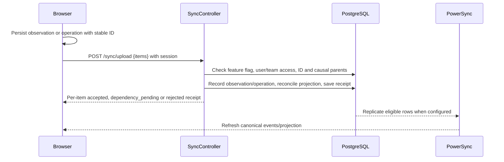

# Offline and concurrent match logging

This page describes the application source implementation. Production activation and physical-device verification are separate evidence.

The browser stores match-day work locally through `frontend/src/offline/`. Authenticated `GET /sync/token` supplies a short-lived PowerSync token. `POST /sync/upload` accepts observations and operations, processing items separately and returning receipts. The client retries a stable ID and unchanged payload; a reused ID with a changed payload or user is rejected. `POST /sync/telemetry` records queue counts and timing. `GET /sync/jwks` publishes verification keys when configured.

`backend/src/database/schema/index.ts` defines immutable event observations, event memberships and operations, clock operations, review records, projection state, upload receipts and client telemetry. The match service reconciles accepted work and updates projections. A dependency-pending receipt means the item must remain queued; rejected work needs explicit review or export. Role and team checks occur on the server during upload.

Deployment depends on Neon logical replication, the PowerSync publication and `powersync/sync-config.yaml`, backend signing and frontend configuration. `OFFLINE_SYNC_ENABLED` and `OFFLINE_SYNC_MATCH_IDS` stage uploads. Consult the application's `docs/offline-operations-runbook.md` before rollout or recovery. Its field-test checklist is a procedure, not evidence that device testing occurred. Do not clear browser storage or uninstall the PWA while unsent work remains; export it first.

Related source: `backend/src/sync/`, `backend/src/matches/`, `frontend/src/offline/`, `docs/contracts-and-authorization.md`, `docs/offline-collaborative-event-logging-plan.md` and `docs/offline-operations-runbook.md` in the application repository.

## Local queue and recovery

`frontend/src/offline/match-store.ts` owns the browser match store. It caches prepared match, squad, opponent and event data, and queues observations and correction operations under a deployment and user scope. The readiness panel checks that match data is present before going offline. Queue states include pending, dependency pending, accepted, quarantined and rejected. A pending clock anchor is kept in local storage. The UI can export unsent observations to JSON and import them for the same account; this is a recovery file, **not a match report**. Browser storage can be evicted or cleared, so the export matters whenever unsent work remains.

## Upload and reconciliation lifecycle

The upload controller processes items independently. A repeated ID with the same payload and user returns its existing receipt; an ID reused with changed content or another user returns `ID_REUSED`. A missing causal parent returns `dependency_pending` with `MISSING_CAUSAL_PARENT`, so the client must retry after the parent uploads. A forbidden or invalid operation receives a safe rejection code and needs user review or recovery export. Source code also gates uploads with `OFFLINE_SYNC_ENABLED` and optional `OFFLINE_SYNC_MATCH_IDS`; the first explicitly disables all uploads when set to `false`.

The server stores immutable observations separately from the canonical `match_events` projection. Membership rows associate observations with a canonical event; append-only operations explain corrections, voids and review decisions. Clock operations and `match_projection_state` retain clock and score/projection revisions. Service authorization still applies during upload, including after a user's team membership changes. A cached client view is not an authorization grant.

## Token and deployment boundary

`GET /sync/token` requires a Better Auth session. When PowerSync settings are missing it returns service unavailable. Otherwise it issues a five-minute JWT with user ID, PowerSync audience and resolved team/role claims. `GET /sync/jwks` exposes the public verification key when the signing key is configured. The sync publication and bucket configuration must match these claims; see the application `powersync/sync-config.yaml`. A compiled frontend, source route or valid token does not prove that replication is running in production. Roll out to an allowlisted match, inspect `/health/operations` and telemetry, verify queue drains and projections on two devices, then widen the allowlist only after a documented field run. The runbook is a procedure, not a recorded successful run.
