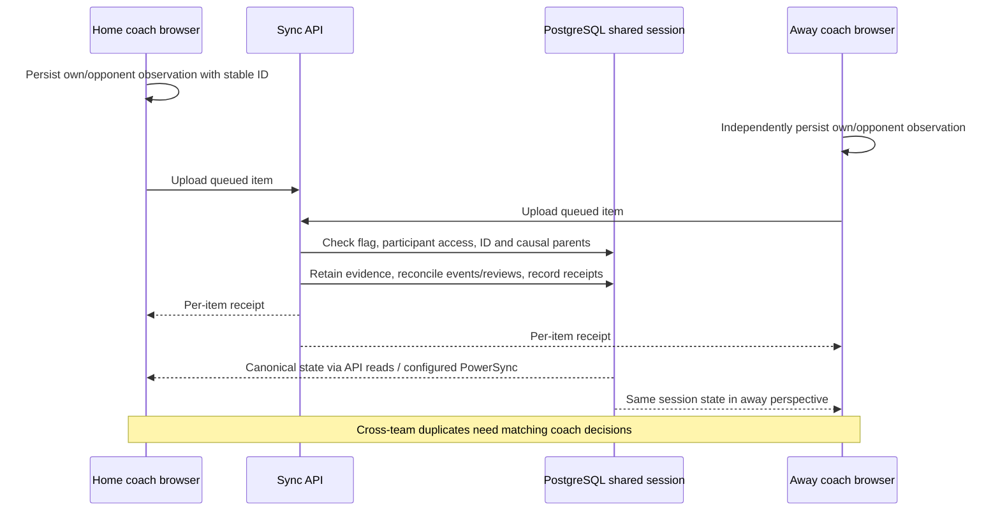

# Offline and concurrent match logging

Updated 7 October 2026 against `feat/matches-two-sided-live-logging`, including the shared substitution fix in `9cd26285`

This page describes the current application source implementation. Deployment, live PowerSync delivery and physical-device verification are separate evidence. Some older implementation and rollout notes describe superseded behavior; in particular, the current shared-report implementation requires both coaches' approval and does not automatically approve after 24 hours.

## Two-sided live logging

For accepted friendlies between registered teams and generated competition fixtures, both teams can prepare their own lineup and log the same match concurrently. Each team retains its own private event and match sheet, with different IDs. Both sheets must link to the same shared session for the exact fixture, with complementary home/away sides. Setup displays and locks the fixture-assigned side rather than trusting a coach's local selection.

The shared session supplies the public canonical timeline, home/away score, clock, review status and final result. Each coach sees those events from their own team's perspective: a home 2-1 result is the away coach's own-team 1-2. Different private sheet IDs are expected; different or missing shared session IDs are an integrity problem. Concurrent starts reuse the fixture session. Safe attachment supports eligible empty sheets; existing recorded history is not silently relinked or merged.

`TWO_SIDED_LIVE_LOGGING_ENABLED=true` enables this backend behavior. Both coaches must reach compatible backend versions with that flag enabled and refresh their sync credentials. Sharing a database alone is insufficient when one client reaches an older or disabled API. A disabled backend rejects starts and event/clock writes to fixtures already enrolled in shared logging. External/free-text opponents retain manual opponent setup and the legacy logging flow.

## Concurrent logging for the opponent

Both coaches can record public match events for **either team**, including selecting an opponent player. Logging is not restricted to events involving the coach's own team. For example, the home coach can log an away goal while the away coach independently records that same goal. The server translates each observation's own/opponent attribution into the shared home/away side.

Each action first becomes an immutable observation with its own stable ID. Distinct actions from either sheet contribute to the shared history. Retrying the same observation does not create another event. Independently recording the same incident creates separate evidence that may require duplicate review; an opponent observation is not discarded merely because the other coach also logged it.

| Situation | Shared behavior |
| --- | --- |
| Coaches record different incidents | Both appear in the canonical timeline, with the appropriate side and player attribution. |
| Both record what may be the same incident | Candidate observations remain available for review; provisional and confirmed totals distinguish unresolved work. |
| Both choose **Count as one event** for a cross-team candidate | The observations resolve to one event; a duplicate goal counts once. |
| Both choose **Keep as two events** | Both incidents remain; two genuine goals count twice. |
| One coach has not decided, or the decisions differ | The cross-team review remains open and blocks final confirmation. Coaches can revise their decisions. |
| An upload is retried with the same ID and unchanged payload | The existing outcome is returned without another action. |

Candidate detection is a heuristic, not proof that two incidents are identical. Nearby genuine events must remain distinguishable. Reviews show observation details, each team's decision and explanatory notes, plus decision history. Cross-team candidates require matching decisions from both coaches; reviews confined to one team's observations use that team's coach resolution path. Assistants can capture events, while coach-only review and approval checks remain enforced by the server.

A queued decision is not a completed resolution. The UI exposes queued, dependency-pending and rejected work; an accepted upload also does not by itself establish delivery to the opponent. Review and result state must converge on the shared session before the match is treated as confirmed.

## Opponent lineup, pitch and substitutions

Registered linked opponents expose a read-only confirmed match lineup: formation, starters, bench, shirt numbers and public placement geometry. Coaches can inspect it during setup and use it in the live pitch, bench and player selectors. Reconfirmation refreshes the opponent view; the confirmed snapshot survives kickoff. Where only the exact-fixture squad fallback is available, it is identified as squad data and does not invent a formation. Generic opponent logging remains available when player information is missing.

Public opponent selections upload safe player labels rather than display keys masquerading as private roster IDs. The shared report preserves shirt numbers and outgoing/incoming substitution labels. The 7 October fix includes the incoming player's public label and resolves the replacement onto both accounts' pitches, so the incoming player appears in the log/report and takes the outgoing player's position. Owning-team identity is recovered locally only when the label uniquely matches that coach's private match squad; ambiguous matches remain unassigned.

Public formation and custom-coordinate changes are applied chronologically to the opponent pitch, ignoring voided events. Only the geometry needed to draw the formation is shared. Saved game plans, private tactical settings, captain/set-piece athlete IDs, draft setup, notes, injuries and the full private roster are excluded. Private injury events and their dependent review evidence remain restricted to the originating sheet. Shared reports do not expose private player IDs.

The logger integrates both teams into the pitch and bench controls, with the score and clock in the top bar. The pitch keeps its proportions and scrolls on short screens so player markers and event controls remain reachable.

## Shared clock and online updates

Either side can operate kickoff, pause/resume, halftime, second-half start and full time. Server-side clock operations are serialized by shared session and update linked sheets with a common elapsed-time anchor and revision. The frontend rebases running timers on newer authority and protects a freshly acknowledged clock from an older poll or sync response. Retries retain the original operation ID, elapsed time, timestamp and base revision; a new action receives a new ID.

Online shared score/clock reports poll every second; the public opponent lineup refreshes independently every two seconds, while the private sheet polls every ten seconds. PowerSync supplies replicated changes when configured and connected. API polling can demonstrate online agreement but does not prove replicated peer delivery or offline recovery. The status indicator distinguishes local queue/upload progress from the live-update connection.

## Shared review, final confirmation and amendments

Full time and final result approval are separate steps. Each coach reviews the canonical report and confirms its current revision. Relevant queued/rejected work and unresolved public reviews must be addressed first. The first confirmation leaves the report awaiting the other coach; **both coaches must confirm** before publication. Silence never approves a shared report, including after 24 hours.

Confirmation validates both the owning projection and shared report revisions. Public event or review changes before finalisation invalidate pending confirmations so coaches must review again. The client refreshes stale state rather than automatically confirming an unseen revision. A coach can withdraw their pending confirmation before finalisation.

Before finalisation, either coach can delete a public canonical event, including one recorded on the peer sheet, with the acting coach/sheet retained for audit and retry handling. Private injuries remain sheet-local. Once both coaches confirm, direct public event/review changes are locked. Additions, corrections and voids use a reasoned amendment proposal with a before/after event and proposed score. Amendments require both teams' approval; rejection, requested changes, withdrawal and stale proposals remain explicit states. The previously published result stays in effect until an amendment is accepted.

Generated competition fixtures publish one canonical result per fixture, feeding both reports, event score displays and standings. Both confirmation orders use the same result; reverse legs remain separate fixtures. Friendlies do not publish competition standings results.

## Local queue and recovery

The browser stores match-day work through `frontend/src/offline/`. `match-store.ts` caches prepared match, squad, opponent and event data, and queues observations and correction/review operations under a deployment and user scope. Previously warmed authorized data can support offline capture; starting with an empty browser cache is not equivalent. The readiness panel checks prepared match data before going offline. A pending clock anchor is kept in local storage.

Queue states include pending, dependency pending, accepted, quarantined and rejected. Reconnection uploads queued work and reconciles it into the shared session. A missing causal dependency stays queued until its parent can upload. Rejected work needs explicit review or recovery; it must not be silently removed. Current membership and role checks still apply after reconnecting, including when a user's membership changed while offline.

The UI exports unsent observations to JSON and imports them for the same account. This is a recovery file, **not a match report**. Browser storage can be evicted or cleared. Do not clear storage or uninstall the PWA while unsent work remains; export it first. Cached protected responses are not an authorization grant: HTTP 401/403/404 failures must not silently fall back to private cached data.

## Upload and reconciliation lifecycle

Authenticated `GET /sync/token` supplies a short-lived PowerSync token. `POST /sync/upload` processes observations and operations independently and returns per-item receipts. `POST /sync/telemetry` records queue counts and timing; `GET /sync/jwks` publishes verification keys when configured.

```mermaid
sequenceDiagram
  participant Home as Home coach browser
  participant API as Sync API
  participant DB as PostgreSQL shared session
  participant Away as Away coach browser
  Home->>Home: Persist own/opponent observation with stable ID
  Away->>Away: Independently persist own/opponent observation
  Home->>API: Upload queued item
  Away->>API: Upload queued item
  API->>DB: Check flag, participant access, ID and causal parents
  API->>DB: Retain evidence, reconcile events/reviews, record receipts
  API-->>Home: Per-item receipt
  API-->>Away: Per-item receipt
  DB-->>Home: Canonical state via API reads / configured PowerSync
  DB-->>Away: Same session state in away perspective
  Note over Home,Away: Cross-team duplicates need matching coach decisions
```

A repeated ID with the same payload and user returns its existing receipt; changed content or another user returns `ID_REUSED`. A missing causal parent returns `dependency_pending` with `MISSING_CAUSAL_PARENT`. A successful batch HTTP response is insufficient: the client inspects every receipt, retains items with missing receipts, and surfaces safe rejection reasons. `OFFLINE_SYNC_ENABLED=false` disables uploads; `OFFLINE_SYNC_MATCH_IDS` optionally allowlists match uploads. These controls are separate from the two-sided feature flag.

`backend/src/database/schema/index.ts` defines immutable observations, memberships, append-only operations, clock operations, reviews, projection state, receipts, telemetry and shared-session/amendment records. Memberships associate evidence with canonical events; operations preserve correction and review history. Server-side reconciliation updates projections rather than treating either private sheet's score as the shared result.

## Deployment and verification boundary

`GET /sync/token` requires a Better Auth session. Missing PowerSync settings return service unavailable; otherwise the API issues a five-minute JWT with user ID, audience and resolved team/role claims. Shared subscriptions additionally depend on the enabled two-sided claim. Backend signing, trusted JWKS/keys, frontend endpoints, Neon logical replication, publication/grants and `powersync/sync-config.yaml` must all match the intended target. Stream rules enforce participant identity, current membership, opposite-sheet visibility and public/private filtering.

Required branch migrations include `0052` (session integrity), `0053` (confirmation invalidation), `0054` (shared clock), `0055` (review privacy visibility), `0056` (shared event deletion) and **`0057_shared_report_approvals.sql`** (revision-bound bilateral reviews/confirmation and amendments), with their earlier prerequisites. Apply the normal migration process to the verified target before dependent backend/rule changes. Deploy compatible frontend/backend code and the applicable sync rules. Do not replay historical migrations merely to clear journal drift or relink recorded legacy fixtures without reviewed reconciliation.

Recorded branch evidence includes fresh paired-account API/browser checks for friendlies and competition fixtures, both confirmation orders, assigned sides, shared clocks, lineups, scores and report reloads. Earlier Development delivery checks verified real online/offline-queued and warmed-peer reconnect delivery, but those checks predate subsequent rule and approval changes. The latest substitution commit records 54 passing focused tests, backend build and frontend type checks. These are existing records, not new test runs performed for this document update, and do not establish the current hosted deployment or physical-device readiness.

Before rollout, verify the intended target's migrations, effective flags, tokens, sync-rule revision and bucket budget. Use two independent coach profiles and fresh fixtures to check opponent-player logging, distinct and duplicate events, both matching and disagreeing review decisions, substitutions on both pitches, alternating clock controls, warmed-client disconnect/reconnect, both final confirmation orders, accepted/rejected amendments, reload persistence, one competition result and outsider/revoked-member denial. Check mobile and short desktop layouts. Inspect `/health/operations`, queue telemetry and exact canonical event IDs on the peer; a valid token or empty local queue alone does not prove delivery.

Related repository sources: `backend/src/sync/`, `backend/src/matches/`, `backend/drizzle/0057_shared_report_approvals.sql`, `frontend/src/offline/`, `frontend/src/features/matches/session-report-model.ts`, `powersync/sync-config.yaml`, `docs/contracts-and-authorization.md`, `docs/offline-operations-runbook.md`, `docs/two-sided-live-logging-plan.md`, `docs/two-sided-live-logging-rollout.md`, `docs/two-sided-delivery-verification.md`, `docs/live-logger-regression-2026-10-06.md` and `docs/two-sided-test-data-repair.md`. Historical notes in those documents must be read against the current source and later follow-ups.
