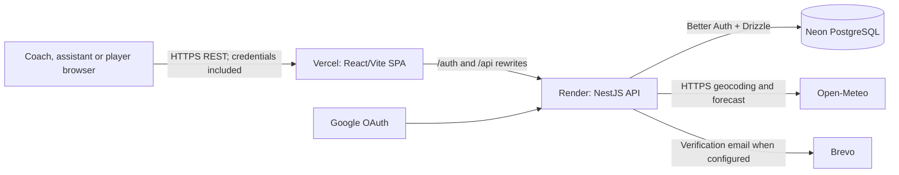
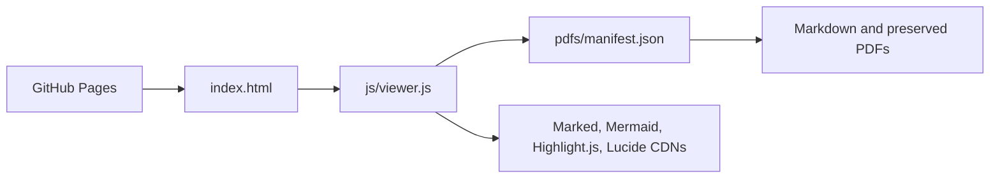

# System Architecture Overview

## Application architecture

The project under assessment is the Gaffer coaching application. It is a separately deployed client/server system; the documentation portal described later is not the application runtime.

### Frontend

React 19 and TypeScript run as a Vite single-page application. React Router defines public, coach/assistant and claimed-player routes. TanStack Query manages server state; feature services call a shared `fetch` wrapper with `credentials: "include"`. Tailwind CSS and local CSS provide presentation; Base UI/shadcn-derived components supply reusable controls. Recharts renders statistics.

Primary areas are `pages/`, `features/`, `components/`, `services/`, `context/`, `hooks/` and `lib/`. The frontend does not connect to PostgreSQL or Open-Meteo directly.

### Backend

NestJS 11 runs on Express. Feature modules contain controllers, services and Zod request schemas for authentication, teams, athletes, invitations/claims, player views, events, game plans, matches, seasons, statistics, dashboard, profile, locations and weather. Swagger is built from controller metadata.

Authentication uses Better Auth with the Drizzle adapter. `AuthGuard` resolves the session cookie. Controllers use `requireTeamId` for member access and `requireCoachTeamId` for coach-only mutations; services scope resource queries to the resolved team.

### Persistence

Drizzle ORM maps 19 PostgreSQL tables and 14 enums. The hosted deployment uses Neon through `@neondatabase/serverless`. Migrations are SQL files under `backend/drizzle`; schema source is `backend/src/database/schema/index.ts`.

### Communication and external services

- Normal application communication is REST over HTTPS with a Better Auth session cookie.
- The backend calls Open-Meteo geocoding and forecast endpoints. Forecasts are cached in process; a recently expired cached result may be returned as stale for up to six hours when the provider fails.
- Brevo sends verification email when configured; in local development without `BREVO_API_KEY`, the implementation logs the verification URL.
- Google OAuth is configured through Better Auth.
- Socket.io client/server packages and the Nest `IoAdapter` are present, but there is no WebSocket gateway or frontend socket connection. Live collaboration/broadcasting is not implemented.

## Deployment

| Component | Current evidence | Notes |
| --- | --- | --- |
| Frontend | Vercel at [gaffer-virid.vercel.app](https://gaffer-virid.vercel.app/) | `vercel.json` rewrites authentication and API requests to Render. |
| Backend | Render at [gaffer-api-ynaf.onrender.com](https://gaffer-api-ynaf.onrender.com/) | API, Swagger and health endpoint. No Railway configuration was found. |
| Database | PostgreSQL on Neon | Connection comes from `DATABASE_URL`; secrets are not documented. |
| Documentation | GitHub Pages | Static HTML/CSS/JS viewer reading `pdfs/manifest.json`. |

All four public URLs were reachable with HTTP 200 on 13 September 2026. That point-in-time check is not an uptime guarantee.

## Documentation portal architecture

The portal has no Docusaurus build and no application API dependency. Adding or renaming a document requires a matching manifest entry. The separate upload page can convert files and use the GitHub Contents API, but it is not needed to read the site.

## Known architecture gaps

- No durable offline event queue or background synchronisation.
- No collaborative WebSocket event distribution despite installed Socket.io scaffolding.
- No repository workflow files proving automated CI/CD.
- OpenAPI describes route shapes incompletely and does not declare cookie authentication.
- In-process weather caching is per backend instance and is lost on restart.

