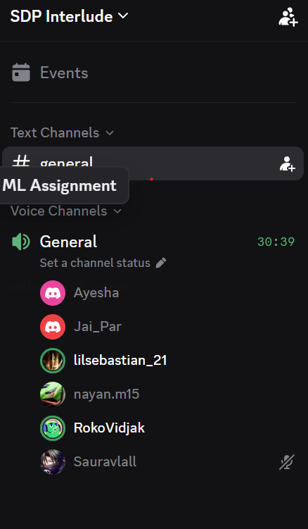

# Sprint 2 Planning Meeting

- **Date:** Thursday, 3 September 2026
- **Time:** 10:30
- **Type:** Sprint planning
- **Mode:** Discord voice call — General channel, SDP Interlude server
- **Recorded duration:** 30:39
- **Attendees:** Not recorded in the source

## Review of the previous sprint

- A Chrome login issue was reported: manual sign-up failed locally in Chrome but worked in Firefox and on the deployed version.
- Clearing cache and cookies resolved the issue for affected users.
- Google authentication and manual sign-up were reported working in Firefox and on the deployed version.
- The homepage image update was approved and merged.
- Two pull requests remained under review.

## Backlog priorities

- The Trello board was reconfigured with new columns and backlog items imported from the use cases.
- The backlog was ordered with simpler features near the top and advanced features near the bottom.
- The team intended to clear Issues/fixes before implementing new features.
- Input validation for fixtures, players and profile details was identified as a gap.
- The Sprint 2 strategy was to add minimum requirements first, then pull in work progressively.

## Decisions and sprint goals

- Use team management, rather than the roster screen, for live-logger squad confirmation so both teams populate the pitch view.
- Support three levels of opponent data: none, shirt numbers only, or full player name and number.
- Prioritise Issues/fixes.
- Implement the live logger's pre-match squad and opponent-lineup confirmation.
- Add use-case descriptions to the product backlog documentation.

## Actions

- Add lightweight descriptions and checklists to each backlog use case.
- Live-logger owner: adapt roster selection into the agreed three-level pre-match opponent flow.
- All team members: review Issues/fixes and Potential Features/Additions.
- All team members: take backlog items from the top and add their names to prevent duplicated work.
- Share further decisions or additions in the group chat.

## Proof of meeting

The source records that the meeting commenced at 10:30 on 03/09/2026 in the Discord General channel. No attendee list is embedded in the source PDF.

## AI declaration

Meeting transcription and notes were generated with the assistance of Granola AI and subsequently reviewed by the team for accuracy.
