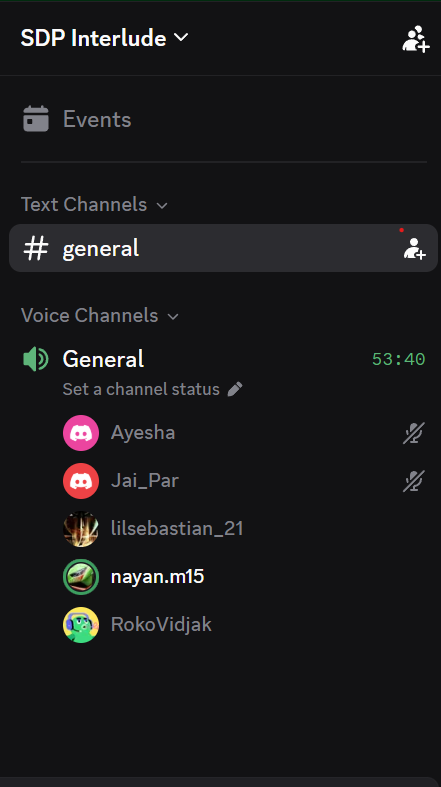

# Sprint 3 Planning Meeting

- **Date:** Friday, 18 September 2026
- **Time:** 16:00
- **Type:** Sprint planning
- **Mode:** Discord voice call, General channel of the SDP Interlude server
- **Recorded duration:** 53:40 shown in the source screenshot
- **Attendees:** The screenshot shows participant display names; the notes do not supply a verified attendance list.

## Review of recent work

The meeting notes reported that the public dashboard was complete and pushed to the development branch. They also reported a successful offline logging scenario in which a match was started online and events could still be logged after connection loss. An assist-after-goal logging bug remained. Public squad information and the injured-player feature were described as in progress. These are meeting reports, not independent test or deployment results.

The team counted 11 current backlog items and estimated that about three would be completed in the immediate period, with eight continuing into the following week. The notes also mentioned improved team-management cards and using VS Code port sharing for local testing.

## Priorities and scope

The discussion prioritised the following work:

- League creation and standings: the creating coach would administer the league, and other coaches would join through an invitation or request flow.
- Opponent fixtures: move opponent-name entry to event creation and offer league teams in a dropdown when relevant.
- Offline event logging: finish the flow and fix the assist-logging defect.
- Public squad and injured-player pages; live-logger and match-report UI improvements.
- Issues/fixes affecting completed events, privacy/terms acceptance storage, roster history, mobile layout, tactics selection, dashboard navigation and event timestamps. The [bug register](../../Project%20Management/bug-tracking.md) tracks individual cards.

The notes listed goalkeeper saves and defender tackles as possible live-logger statistics. A map/minimap, calendar import, more formations, a login “Remember Me” option, voice assistance and automatic yellow-card suspension were discussed as potential features. **Multi-user concurrent event logging was recorded as deferred/not yet implemented at this meeting.** These notes do not establish later delivery status.

### Issues/fixes named in the planning notes

| Area | Items raised |
| --- | --- |
| Roster and pre-match | Show recent athlete match logs; reduce the opponent-data pitch size; fix tactic selection and allow drag replacement for injured or out-of-form players. |
| Events and fixtures | Opening an already-completed event should lead to its report rather than squad confirmation; move opponent name to event creation and list league teams where applicable. |
| Live logger and report | Show event time in the match log/history for offline sync; improve the opponent-event button, mobile match-log tab and match-report UI; consider goalkeeper saves and defender tackles. |
| Navigation and layout | Scope scrolling to the events tab, fix the mobile footer and formation-list overflow, reset the landing tab to Overview on refresh, and connect dashboard “View all” buttons. |
| Account/policy | Persist acceptance of privacy policy and terms on the server. |

These were discussion items. Their individual tracker status and later fixes need to be checked against Trello and the application revision.

## Goals and actions recorded

- Aim to complete the 11 then-current backlog items before the stated 29 September deadline.
- Complete the league, fixture, public squad, injury and offline work described above.
- Check unique team names at creation and refine pre-match player replacement for injured or out-of-form athletes.
- Update Trello after the meeting, finalise live-logger UI decisions and assign documentation work.
- Collect user feedback and connect resulting fixes to commits.

The source proposed a feature document covering major features, API, database and testing. This was an action, not evidence that the document was completed or reviewed.

## Proof of meeting

The source records a 16:00 start on 18 September 2026. The embedded Discord screenshot shows the General voice channel with **53:40 elapsed**. It supports that a call was in progress; it does not verify every decision or attendee's participation throughout the call.

## AI declaration

The source states that meeting transcription and notes were generated with Granola AI assistance and subsequently reviewed by the team for accuracy. This declaration is preserved from the supplied record.
