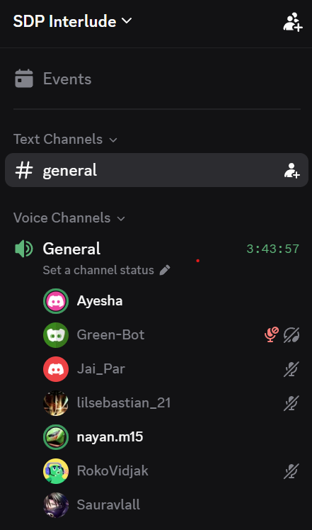

# Sprint 2 Retrospective

**Mon, 14 Sept 26**

## Doc Site Format Review

- Auto-import converts files to MD, but headings don't convert cleanly.
  - Manual editing required after each upload.
  - Sprint 2 planning meeting upload flagged as an example of the formatting issue.

## HTML Uploads for Privacy Policy

- Question raised: can HTML files be uploaded to the doc site?
- Decision: keep privacy/terms pages on the existing website, but also add them to the doc site.
  - Try uploading the HTML files directly first.
  - If that fails, send the files over to be converted to Markdown manually.

## Sprint 2 Issues Noted

- Live Logger form loses all data if user navigates away before confirming.
  - Proposed fix: auto-save form state when user leaves the screen.

- Intermittent white element appearing on screen (top right); seen before, cause unknown.

- New account flow doesn't prompt user to add or join a team.
  - App just blurs out dashboard and other options with no explanation.
  - Fix: add a popup or message saying "join or create a team to unlock features".
  - To be added to Trello.

## Sprint 3 and Submission Timeline

- Sprint 3 due: **29th September**
- Submission deadline: **11th October (Sunday, 2nd week of October)**
- Group presentations: **19th to 23rd October**
- Sprint retrospective and group review documentation due dates on Moodle.

## Documentation and Tomorrow's Plan

- Uploading Sprint 1 and Sprint 2 retrospectives to the doc site.
- Plan to finish documentation today; all good to go for tomorrow.

## Next Steps

- **Attempt HTML file upload to doc site:** If upload fails, send the 2 files over to be converted to Markdown manually.
- **Add "join or create a team" prompt to sporting tool:** New account flow needs a message to unlock features when no team is joined.
- **Upload Sprint 1 and Sprint 2 retrospectives to the doc site.**

## Proof of Meeting

Meeting commenced at **12:25 on 14/09/2026**.

Discord voice call — General channel, SDP Interlude server.

## AI Declaration

Meeting transcription and notes were generated with the assistance of Granola AI and subsequently reviewed by the team for accuracy.
