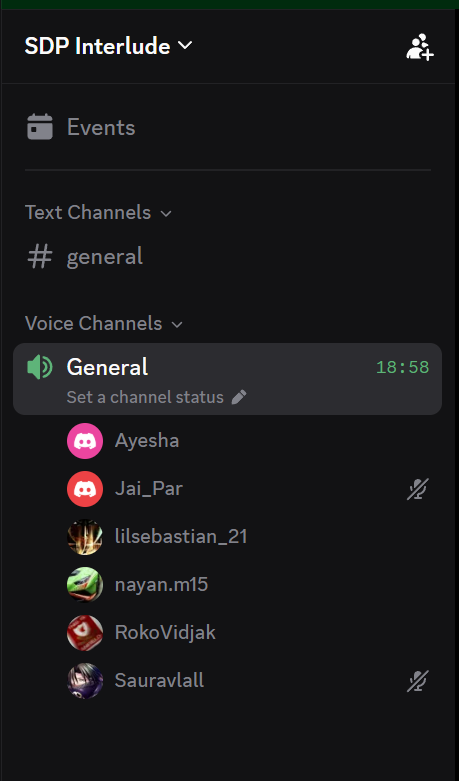

# Sprint 3 Retrospective

**Date:** Mon, 28 Sept 26

## Open PRs

- 3 PRs still open
- Hemesh's branch: fixing high-severity SonarQube issues, most resolved
  - Testing approach: manually interact with the site on that branch (inputs, deletes, etc.)
  - 4 merge conflicts on Hemesh's branch; to be resolved before review
  - Ayesha's branch also has a merge conflict, to be fixed
- Two team members to test Hemesh's branch while others focus on UI changes

## Remember Me Feature

- Current behaviour: Remember Me creates a 7-day cookie, but only works if user navigates directly to the dashboard route, not the landing page
- Issue: real users go to the landing page, not a specific route
- Fix agreed: if a valid login cookie exists, redirect from the landing page straight to the dashboard
  - Essentially a rerouting change, not a cookie change

## Mobile Navigation Redesign

- Proposal: replace sidebar-only navigation with a bottom navbar on mobile
  - 4-5 main pages in the bottom bar, remaining pages in the sidebar
  - Team agreed this is a better flow
- To be implemented in the current UI branch, estimated 30 minutes to an hour
  - Others need this branch, so a push notification was requested

## Sprint Deadline and UI Tests

- Sprint review is tomorrow; whatever is complete will be demoed
  - Incomplete features can be finished after the sprint, no missing requirements
- UI tests have not passed in over a week (last passing run was BR-18)
  - One more attempt planned; if still failing, the UI test step may be removed
  - Code quality, build, and API tests passing, so UI test failure is isolated to frontend
- Two features pushed to dev but not main were noticed during a demo with Jan
  - Will be sorted before tomorrow's demo
  - Matches update behaviour to be verified after the lead flow is completed today
- Team call at 5:30 PM

## Proof of Meeting

Meeting commenced at 12:06 on 28/09/2026.

Discord voice call — General channel, SDP Interlude server (18:58 elapsed):

---

*AI Declaration: Meeting transcription and notes were generated with the assistance of Granola AI and subsequently reviewed by the team for accuracy.*
