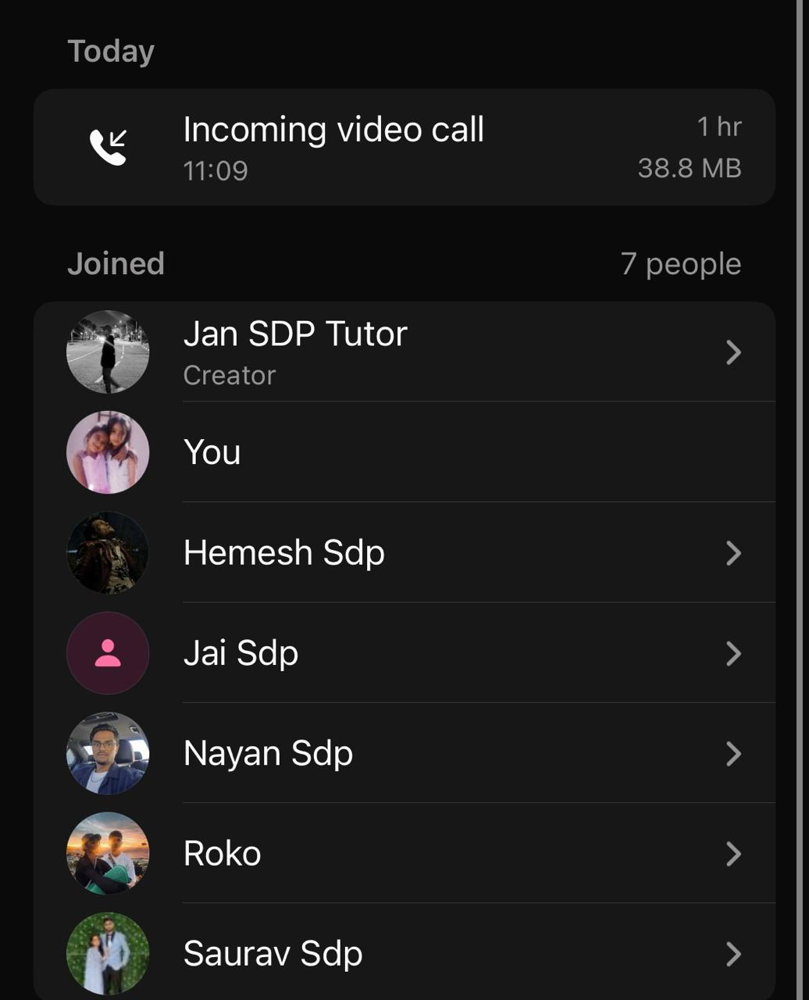

# Sprint 2 Review with Client (Jan)

**Mon, 14 Sept 26**

## Documentation Review

- **Bug tracker:** covers both Sprint 1 and Sprint 2 items; searchable and well-structured.
  - Completed bugs marked with green tick; unresolved ones show as unassigned.
  - Confirmed bug tracker earns 100%.

- **Meeting notes file structure needs reorganising.**
  - Currently: planning, standups, retrospective under Sprint 1, but no sprint review notes.
  - Fix: separate Sprint 1 and Sprint 2 sections, each with planning, standups, retrospective, and review.

- **Stakeholder section needs a dedicated page.**
  - Reviewer should be able to search "stakeholder" and find evidence of interaction.
  - Add links to relevant sections; brief explanation of how stakeholder feedback was incorporated.
  - Without this, would score ~80%; with it, likely 100%.

- Meeting notes (physical documents) not yet uploaded to the documentation site; must be done before tomorrow's review.

## Testing and CI Pipeline

- CI workflow runs on every push to main via GitHub Actions runner (set up per Brendan's guidance).
  - Tests frontend, backend, database migrations, and integration tests.
  - UI tests only run if both code quality and API test jobs pass.
  - Full build takes roughly 14 to 20 minutes.

- **Current status:** API test job failing, so UI tests have not yet run.
  - Fix in progress during the meeting; database URL being updated and pushed.

- No deployment job in the pipeline yet; UI tests currently test the deployed version once triggered.
- Documentation explaining how the tests work to be written later today.
- Automated testing earns 100% with documentation in place.

## Product Demo

- **Dashboard:** shows active athletes, scheduled events, upcoming events with weather and directions, recent forms, season summary, win rate, clean sheet rate, scoring rate.

- **Roster:** add, search, archive athletes; invite assistants.

- **Events and calendar:** training, matches, meetings; add new events with venue, date, time, street address.

- **Live Logger walkthrough:**
  - Set up match with opponent squad (no info, numbers only, or numbers and names).
  - Log goals, assists, yellow/red cards, substitutions, injuries, penalties in real time.
  - Auto-halftime warning at 45 minutes; proceeds to extra time if no interaction.
  - Match report generated on completion: events, team comparison, score progression, squad and tactics, top performers.

- **Stats:** season overview, form trend chart, points progression, goals scored/conceded per match, per-player breakdown; supports multiple seasons and competitions.

- **Roster issue confirmed fixed:** athlete status now updates correctly.

- **Overall impression:** UI praised as clean and intuitive; easy to use even for non-tech-savvy coaches.

## Rubric Summary and Outstanding Items

Scores as assessed during the meeting:

- Software tests (CI/automated): **25% (full marks)**
- Automated test documentation: **100%**
- Testing documentation: **100%**
- Methodology: **100%**
- Bug tracker: **100%**
- Database: **100%** (schema updated and documented)
- Third-party code: **100%**
- API: **100%**
- Stakeholder reviews: **~80% currently**, fixable to 100% with documentation
- User feedback: **pending**, currently fewer than 10 responses; target 20 to 40

Team confident no follow-up meeting needed tomorrow unless documentation questions arise; will contact via Discord if needed.

## Next Steps

- **Fix documentation site file structure:** Separate Sprint 1 and Sprint 2 sections, each containing planning, standups, retrospective, and review notes.

- **Add stakeholder section to documentation site:** Include a brief explanation of stakeholder interaction and link to supporting evidence across other sections.

- **Upload meeting notes and write test documentation:** Both must be on the documentation site before tomorrow's sprint review.

- **Collect and upload user feedback data:** Target 20 to 40 responses; format and upload to the documentation site before the review.

- **Fill out the team's user feedback form.**

- **Hold a team retrospective:** Internal meeting to reflect on what went well and what didn't before Brendan's formal marking.

## Proof of Meeting

Meeting commenced at **11:09 on 14/09/2026**.

WhatsApp voice call — SDP(Sports) Group (**60:00 elapsed**).

## AI Declaration

Meeting transcription and notes were generated with the assistance of Granola AI and subsequently reviewed by the team for accuracy.