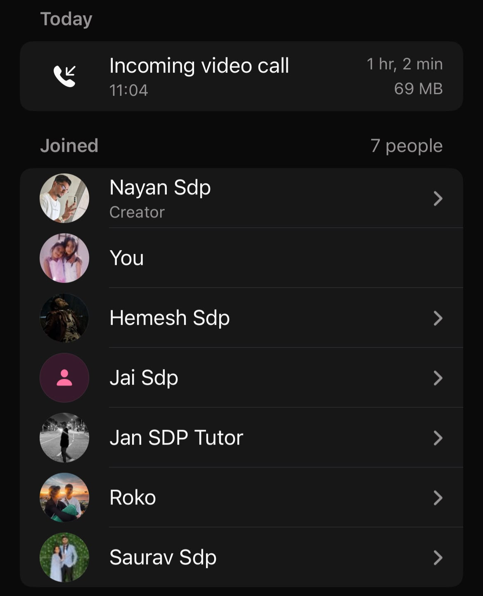

# Sprint 3 Review

**Date:** Mon, 28 Sept 26

## Code Coverage and Testing

- SonarQube used for code coverage tracking, visible on the README badge
  - Current coverage: 63% (front end + back end combined)
  - Older features at 90–100%; newly implemented features at 0% or low
  - Front-end tests not under the front-end folder in the repo, so not reflected in SonarQube view
    - Fix: move files to correct folder tonight
  - Issues flagged by SonarQube not yet pushed to main
- Testing and Quality Assurance doc on the documentation site covers all test types:
  - Back-end, front-end, API, integration, end-to-end (browser) tests
  - Linting via Oxylint with full coverage
  - Database protection rules in the back end
- Target: 80%+ coverage by the final submission
  - Plan to implement more tests between now and end of week
- Performance documentation not yet written; to be generated before tomorrow's sprint review

## Feature Implementation Walkthrough

- Alternative football formats: 5-a-side and 7-a-side team creation on account setup
- Automatic season scheduling: coach creates a league, adds teams, system generates fixtures with dates and kickoff times
- Automated performance insights: Gemini-powered in-app bot
  - Generates top scorer, best performer stats without manual lookup
  - Also used on the roster page to add players via prompt instead of manually
- Fixture setup with opponents: event creation pulls opponent teams from the league
- Location API updated: autocomplete and device-location fallback
- Player selection suggestions: suggests best XI based on availability, recent form, injuries, and suspensions
- Injury tracking: logs injury type, grade, estimated return date, and rehab status on an interactive player model
- Public dashboard: team/player stats, fixtures, results, and league standings viewable without login
- Sharing and report export: completed match events exportable as PDF or shareable link
  - Includes timeline, goals, cards, substitutions
- Offline event logging: events saved to device when offline, synced to database on reconnect
- Concurrent event logging: duplicate events flagged for coach review when two staff log the same event simultaneously
- League and standings management: filter by league, view results, fixtures, and standings
- Bug tracker active; goalkeeper saves added among recent fixes

## Client Feedback and Next Steps

- Overall verdict: 100% for this sprint
  - Tests pipeline looks good; front-end coverage just needs file reorganisation
  - User feedback: 100%
  - Feature implementation: 100%
  - API documentation and endpoint explanations on the doc site: no complaints
  - Performance: no issues observed; error messaging (e.g. duplicate league name) works well
  - Methodology including sprint retrospectives: looks good
- Suggestion: add a "stakeholders" keyword to the documentation site so sprint review interactions are searchable
- Feedback on demos: pre-populate data (leagues, results, logs) before the meeting so live setup doesn't eat into demo time
- Final review meeting scheduled for tomorrow at 1:00 PM; location to be confirmed via message in the morning

## Next Steps

- Move front-end test files to the front-end folder in the repo
  - So SonarQube reflects front-end coverage correctly; to be done tonight
- Generate performance documentation before tomorrow's sprint review
  - Performance fixes have been implemented but are not yet documented
- Pre-populate demo data before tomorrow's meeting
  - Add league results, logs, and player data so features can be shown without live setup delays
- Confirm tomorrow's 1:00 PM final review location
  - Message the team early in the morning with the meeting spot

## Proof of Meeting

Meeting commenced at 11:04 on 28/09/2026.

WhatsApp voice call — SDP(Sports) Group (60:02 elapsed):

---

*AI Declaration: Meeting transcription and notes were generated with the assistance of Granola AI and subsequently reviewed by the team for accuracy.*
