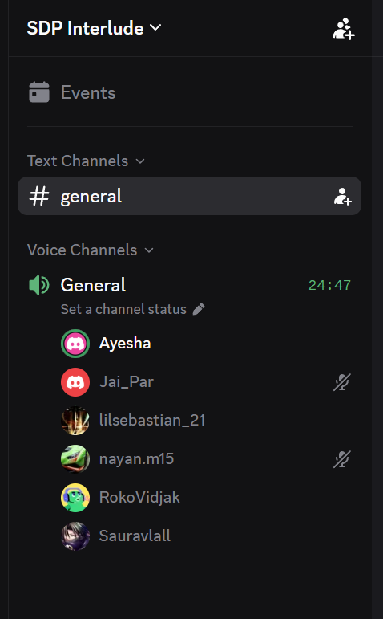

# Standup Meeting 1

- **Date:** Monday, 17 August 2026
- **Time:** 20:05
- **Type:** Team standup
- **Mode:** Discord voice call
- **Attendees:** Not recorded in the source

> The previous filename used 11 August, but both the document date and proof line record 17 August 2026. The filename now follows the recorded meeting date.

## Announcements

- The only implementation reported at that point was project setup by Nayan and Hemesh; no features were reported complete.

## Completed work

- Saurav completed project setup and the initial branch structure.
- Jai uploaded the technology-stack guide to the group and documentation site.

## Next work

- Members planned UI work, branch creation and pull requests.
- Ayesha was to add user stories to Trello under a new Sprint 1 list.

## Blockers

- The Trello board required substantial work before sharing with the tutor.
- The documentation site's AI-policy page was broken after its Markdown file was accidentally deleted.

## Decisions and actions

- Standups were scheduled for Monday, Tuesday and Thursday.
- Changes were to flow through feature branches and `development` before `main`.
- The team recorded local `npm run deploy` and `npm run lint` checks before commits and Drizzle migration commands for database changes.
- Add Sprint 1 user stories, clean up Trello, update branding, resend the stack guide and send the meeting document for the README update.

## Proof of meeting

The source records that the meeting commenced at 20:05 on 17/08/2026 by Discord voice call.

## AI declaration

Meeting transcription and notes were generated with the assistance of Granola AI and subsequently reviewed by the team for accuracy.
