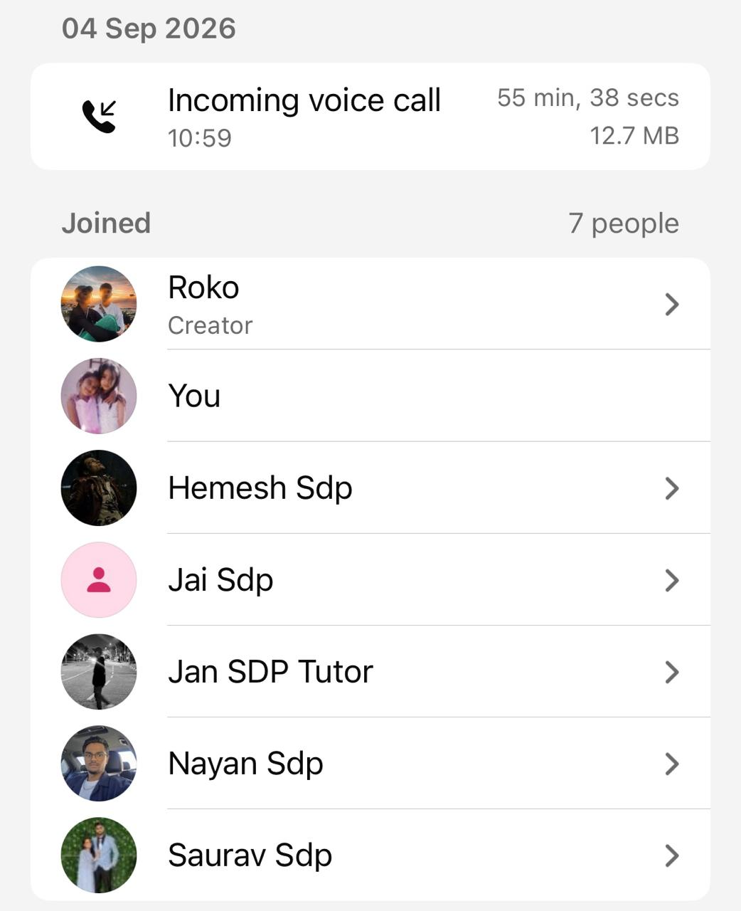

# Standup Meeting 5

- **Date:** Sunday, 13 September 2026
- **Time:** 11:30
- **Type:** Team standup
- **Mode:** Discord voice call — General channel, SDP Interlude server
- **Recorded duration:** 19:09
- **Attendees:** Saurav was unavailable; other attendees were not individually recorded

## Announcements

- This was recorded as the second standup of the sprint; a third was planned for the next day.

## Completed and current work

- The team lead was testing Jai's player-role email pull request.
- The team lead reported implementing 45- and 90-minute auto-end warnings with a one-minute fallback.
- The timer feature was to be tested during a football match that day.

## Planning and discussions

- About 11 use cases were reported remaining across Sprints 2 and 3.
- Sprint 3 was intended to complete project-brief features; additional desirable features were intended for the two weeks after Sprint 3.
- Goalkeeper saves were proposed as a statistic, including saved missed penalties; defender/tackle statistics were deferred.
- The opponent-event button needed greater visibility and was recorded on Trello.
- A privacy-policy use case was to be added.

## Actions

- Add and complete checklists for in-progress use cases before the next meeting.
- Submit a Discord screenshot and upload meeting documentation before Tuesday.
- Merge the upcoming-reminders and terms-and-conditions pull requests.
- Ask Jan to review Trello and the deployed application before the next meeting.
- Edit the README structure, add goalkeeper saves to the tracker, and move sharing/report work to Backlog with Nayan assigned.

## Proof of meeting

The source records commencement at **11:30 on 13/09/2026** and a **19:09 Discord voice call**.

## AI declaration

Meeting transcription and notes were generated with the assistance of Granola AI and subsequently reviewed by the team for accuracy.
