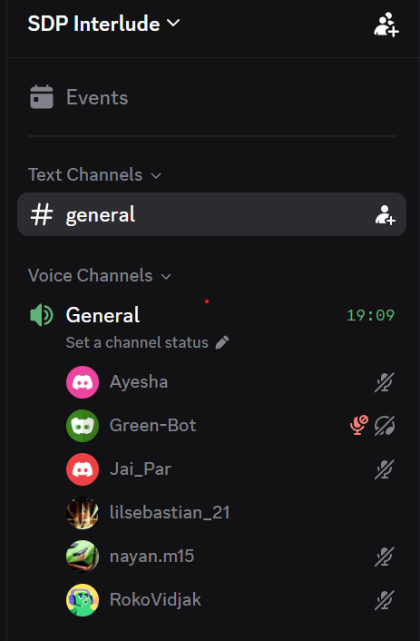

# Daily Standup Meeting 3

**Mon, 14 Sept 26**

## Announcements

Daily Standup Meeting 3 before meeting with Jan (Client) scheduled for 11:00.

## Updates

### Team

- **Yesterday:** sent database env link (accidentally sent admin password instead of test data URL, corrected via WhatsApp).
- **Today:** finishing workflows, almost done, running final pipeline test.
- **Blocker:** pipeline runner shared with another group, causing long wait times.
  - One run took approximately 20 minutes.
  - Others took approximately 3 minutes but failed due to bad database URL.

### Saurav

- Has a branch ready to test and merge into dev.
- Team to quickly test and merge once pipeline is free.

## Sidebar

### Pipeline Delays

- Actions taking up to half an hour to run, which is a concern if applied to the dev branch.
- Decision: keep the workflow action on main for now, not dev, since main is not the deployed branch.
  - Deployment requires a separate push to the GitHub branch.
- Will add to dev branch after marking is done.

### Workflow Branching Decision

- Implementing on dev branch is safer as it allows fixes before publishing.
- Team agreed to leave it on main for now and revisit dev later.

### Meeting Timing

- Standup with Jan was pushed to 11.
- Team sent a message to start when free.

## Action Items

- Replace old database env with the correct one shared on WhatsApp.
- Test Saurav's branch and merge into dev once pipeline runner is free.
- Send the review link to more groups to gather as many responses as possible.
- Revisit adding workflow action to dev branch after marking.

## Proof of Meeting

Meeting commenced at **10:33 on 14/09/2026**.

Discord voice call — General channel, SDP Interlude server (**24:47 elapsed**).

## AI Declaration

Meeting transcription and notes were generated with the assistance of Granola AI and subsequently reviewed by the team for accuracy.