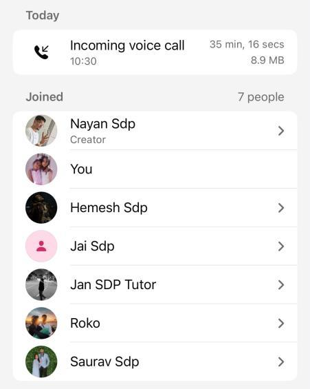

# Standup Meeting 7 — Sprint 3

- **Date:** Thursday, 24 September 2026
- **Time:** 10:30
- **Type:** Standup with client Jan, as titled in the source notes
- **Mode:** WhatsApp voice call, SDP (Sports) group
- **Recorded duration:** 35:16 shown in the source screenshot
- **Attendees:** The screenshot shows seven joined accounts, including an account labelled “Jan SDP Tutor”; it does not establish approval of any feature.

## Updates and blockers

The team discussed offline logging and sync, public squad/player information, sharing and game-report export, concurrent logging, leagues and standings, generated fixtures, injury/recovery estimates and PWA support. Automatic season scheduling, player selection suggestions, performance insights and alternative football formats were also named. **This is a discussion list, not a list of completed features.**

The notes report that backend tests were still being fixed before a push to `main`, and that concurrency between two accounts with app access had not yet been tested. A coverage target above 60% was raised, with separate frontend, backend and whole-project figures requested; the notes include no measured coverage result. About 60 Google Form responses were mentioned, without the underlying response export in this meeting record.

## Discussion and decisions

- Goalkeeper saves were treated as a priority statistic. Tackles were considered too frequent for the live logger at that point; voice assistance was floated as a possible future aid.
- Free kicks and corners were discussed but not prioritised for live logging. The group considered free-kick events as a possible way to capture fouls.
- The penalty workflow should allow a coach to reassign the taker during a match if the original taker is injured.
- The group discussed endpoint security and the need to review Git history, pull requests and documentation before assessment.
- A full review and documentation walkthrough was planned for the following Monday. This record does not establish that the later meeting occurred.

## Actions recorded

- Fix remaining backend tests and push the reviewed work to `main`.
- Implement goalkeeper saves; revisit free kicks later.
- Test concurrent access and logging with two accounts.
- Update Trello with the discussed work and update the REST API guide.
- Send performance documentation evidence after the meeting and measure coverage before the review.
- Deploy the next feature batch and resend the feedback form, then hold the planned review.

## Proof of meeting

The source records a 10:30 start on 24 September 2026. Its embedded WhatsApp screenshot shows an incoming group voice call lasting **35 minutes, 16 seconds** and seven joined accounts. It supports the call record, not the accuracy of every implementation or testing claim in the notes.

## AI declaration

The source states that meeting transcription and notes were generated with Granola AI assistance and subsequently reviewed by the team for accuracy. This declaration is preserved from the supplied record.
