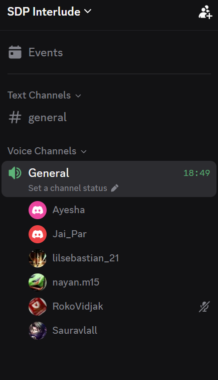

# Daily Standup Meeting 8

**Date:** Sun, 27 Sept 26

## Updates

- Noticed old static landing page (orange formation) briefly appears before the new interactive page loads on pull from development
- Completed goalkeeper saves and penalty miss implementation in a PR ready for review
- Tested PWA on Samsung internet; app installs and opens, signs in successfully
- Alternative formats feature nearly done; waiting on PR to be pushed to development to avoid migration timestamp conflict
- Working on saving account locally so users don't have to sign in on every reload
- Noticed logout option missing when logged in as a coach; others confirmed it works on their end

## Sidebar

- PWA install on mobile: works via Samsung internet browser URL bar, but not visible locally on some devices; team to investigate app protection settings
- Suggested adding an in-app install button so users don't have to go through the browser
- AI assistant for Roster command well-received; suggestion to move it somewhere more prominent than bottom right
- Automatic season scheduling feature confirmed done
  - Creates fixtures automatically based on number of teams
  - Flagging clashes is a separate concern and not required
- User feedback: currently at 20 responses; aiming for at least 10 more before Tuesday
- Send the app to more people for testing

## Action Items

- Implement local account saving; target tonight, latest tomorrow afternoon
- Get goalkeeper/penalty PR pushed to development today
- Merge alternative formats once the PR is pushed
- Research an in-app PWA install button
- Update the user feedback document on the doc site Tuesday morning
- Hold a 15-minute standup before the 11:30 AM meeting with Jan
- Hold a sprint review and retrospective with Jan

## Proof of Meeting

Meeting commenced at 20:00 on 27/09/2026.

Discord voice call — General channel, SDP Interlude server (18:49 elapsed):

---

*AI Declaration: Meeting transcription and notes were generated with the assistance of Granola AI and subsequently reviewed by the team for accuracy.*
