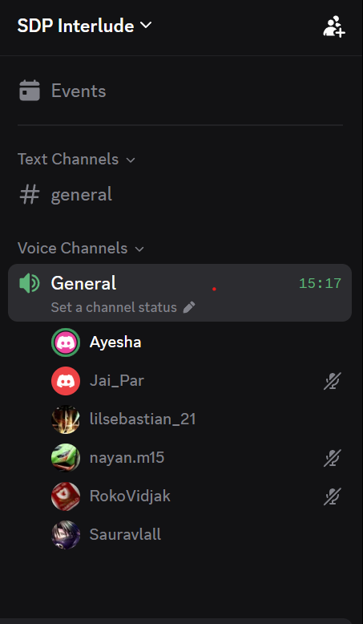

# Daily Standup Meeting 3

**Date:** Mon, 28 Sept 26

## Updates

- Fixed high priority SonarQube issues; many medium priority issues and blockers still remain
- Blockers are mainly input validation related
- Splitting UI tests into 2 shards to address timeout crashes
  - Runner was offline Friday night to Saturday morning
- Working on stats page updates
  - Goalkeeper saves not yet reflected on stats page, only on match report
- League/competition stats not auto-updating after match save for some users
- Working on injuries page
  - Red dot indicator needs to be highlighted by default, not just on hover
- Updated doc site earlier in the week; some features still missing
- Working on landing page fixes and background changes for light/dark mode
  - Dashboard and roster done
- App logo looks good on mobile
  - Chrome browser blocks download and needs security fixes

## Sidebar

- App download on Samsung browser shows "unsafe app blocked" and older Android warning
  - Team acknowledged limited security measures currently in place
- SonarQube helping identify issues
  - May stress-test the site for performance and input vulnerabilities
- iOS (Safari) download worked fine
  - Chrome download blocked entirely and needs fixing
- T&Cs and privacy policy updated on doc site
  - Need to verify changes match what is live on the website

## Action Items

- Fix medium priority and blocker issues flagged by SonarQube (input validation)
- Update stats page so goalkeeper saves appear correctly
- Investigate league/competition stats not updating after match save
- Update terms and services and privacy policy on the website
- Update injuries page so injured section is highlighted by default, not just on hover
- Fix Chrome browser download issue after security measures are addressed
- Update doc site with missing features and update landing page feature listing
- Finish background changes for remaining pages (light/dark mode)

## Proof of Meeting

Meeting commenced at 10:00 on 28/09/2026.

Discord voice call — General channel, SDP Interlude server (15:17 elapsed):

---

*AI Declaration: Meeting transcription and notes were generated with the assistance of Granola AI and subsequently reviewed by the team for accuracy.*
