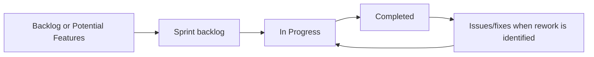

# Agile and Scrum Methodology

## Evidence basis

The team uses Trello as its visible work board and maintains planning, standup and retrospective records in this portal. This page distinguishes recorded practice from recommended process. It does not infer attendance, stakeholder approval or named Scrum roles where records do not establish them.

## Work artefacts and flow

- **Product backlog:** future feature cards are mainly in `Backlog` and `Potential Features/Additions`; setup/process work remains in separate lists.
- **Sprint backlog:** selected work moves into the named sprint list. The export shows explicit S2 cards moving through `Sprint 2 Backlog`, `In Progress` and `Completed`, although the Sprint 2 Backlog list is currently empty.
- **Issues/fixes:** 48 active and one archived card are recorded separately; see [Bug Tracking](bug-tracking.md).
- **Delivery record:** `Completed` contains 13 active cards; see the historical Sprint 2 records. Board completion and checked checklists do not replace acceptance evidence or reconstruct the original sprint commitment.

Observed movement is broadly:

## Ceremonies

### Sprint planning

Planning should select refined stories, state a sprint goal, confirm capacity/owners, agree acceptance criteria and identify dependencies. Existing Sprint 1 and Sprint 2 planning records are linked in the Meetings navigation. The current Trello export shows S2 selection/movement but cannot reconstruct the original commitment or sprint goal by itself.

### Standups

The original product-requirements record states a cadence of every three days. The same meeting-derived page also records “3 per week,” and the Sprint 1 retrospective says the wording should be corrected from “every 3 days” to “3 per week.” The definitive current cadence therefore requires team confirmation; both records are preserved rather than silently choosing one.

Standups should cover completed work, next work, blockers and board changes. Existing standup records remain under Meetings; none are created by this update.

### Sprint review

Demonstrate accepted stories against the identified build, record stakeholder feedback verbatim or clearly paraphrased, and add resulting backlog/bug cards. A demonstration is not approval unless the stakeholder decision is recorded.

### Retrospective

Review team process, identify concrete improvements and carry owned actions into the board. Existing retrospective evidence is preserved; no additional completed ceremony is claimed.

## Responsibilities

| Responsibility | Expected contribution |
| --- | --- |
| Product/stakeholder representative | Clarify value and requirements; review outcomes. No approval is inferred. |
| Product-backlog ownership | Order/refine cards and keep stories/acceptance criteria coherent. Named owner not established. |
| Scrum facilitation | Facilitate ceremonies and remove process blockers. Scrum-master names not established. |
| Developers | Estimate/select work, implement/test/review, update Trello and documentation. |
| Card owner | Coordinates the recorded card; assignment is not sole authorship or acceptance. |

## Proposed Definition of Done

> [!NOTE]
> Trello card #34 still asks the team to agree a Definition of Done. The following is proposed, not confirmed adoption.

- Acceptance criteria satisfied and demonstrated on an identified revision.
- Relevant unit/API/browser regression coverage added and required checks pass.
- Team/role isolation, validation, accessibility and mobile impact reviewed.
- Schema/API/environment/deployment documentation updated where affected.
- Review completed; related Trello/bug card and AI attribution updated.
- Test results and artefacts retained; known limitations recorded.

## Feedback and defects

Stakeholder/user feedback should be linked to a new or existing backlog card, assessed for scope and priority, and selected in a later planning decision. Defects follow the [proposed bug workflow](bug-tracking.md#proposed-bug-workflow) and return to planning when they cannot be resolved immediately.
